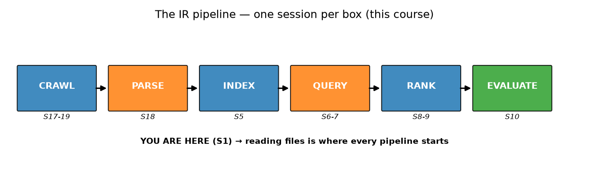
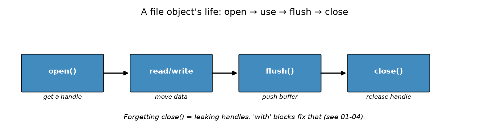
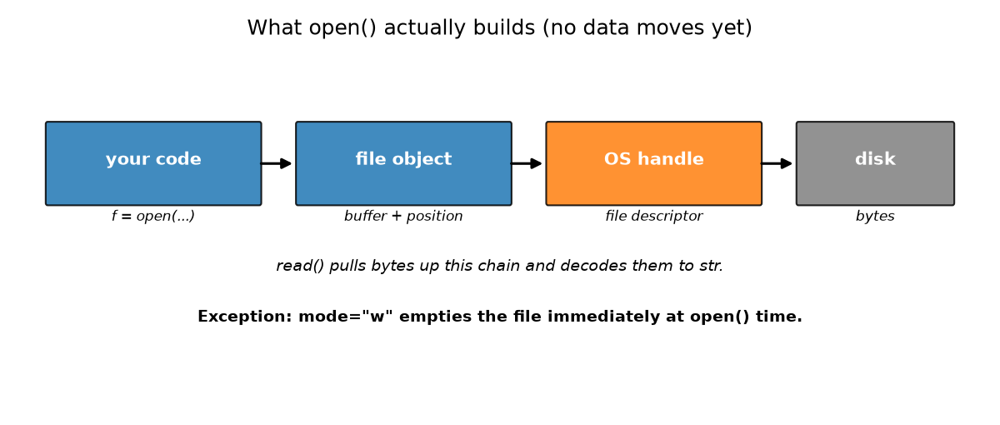
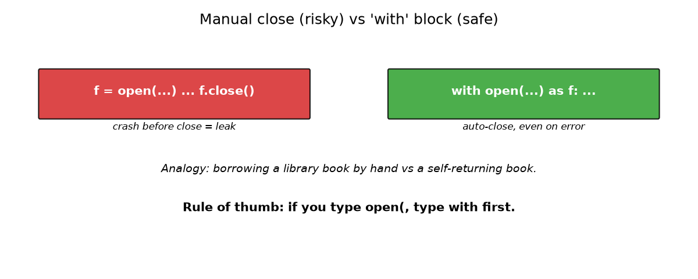
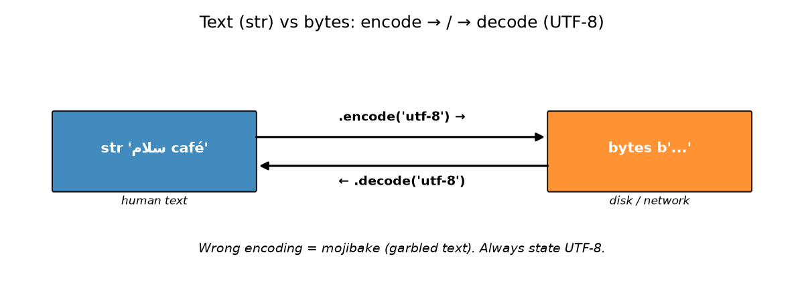
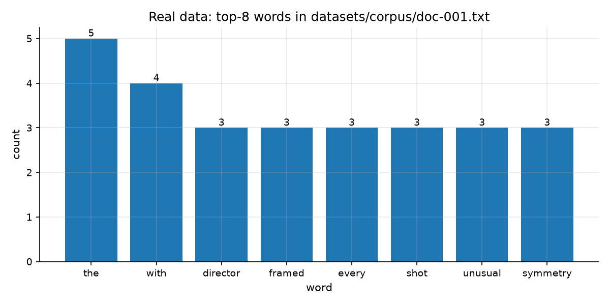

# نشست ۰۱: معرفی دوره و کار با فایل متنی در پایتون
> هر موتور جست‌وجو از همین‌جا شروع می‌کند: خواندن فایل متنی. در پایان این نشست می‌توانی آمار هر فایل از پیکره‌ی دوره را بررسی کنی.

## در این نشست چه می‌آموزیم
- کار با فایل در خط لوله‌ی بازیابی اطلاعات کجاست و بقیه‌ی ۲۴ نشست کجا به آن وصل می‌شوند
- باز کردن، خواندن، نوشتن و بستن فایل متنی، و این‌که چرا بستن فایل اهمیت دارد
- الگوی بلوک `with` که فایل را حتی هنگام بروز خطا هم می‌بندد
- تفاوت متن و بایت، و این‌که رمزگذاری و رمزگشایی UTF-8 دقیقاً چه می‌کنند
- خواندن خط‌به‌خط و شمارش واژه‌ها روی پیکره‌ی واقعی دوره

## مفاهیم

### ۰۱.۱ کجای مسیر هستیم: خط لوله‌ی IR

موتور جست‌وجو یک خط تولید است: صفحه‌ها را **می‌خزد**، متن را **تجزیه** می‌کند، یک **نمایه** می‌سازد، به **پرس‌وجو** پاسخ می‌دهد، نتایج را **رتبه‌بندی** می‌کند و در پایان آن‌ها را **ارزیابی** می‌کند. هر جعبه در تصویر بالا یک نشست از این دوره است.

تشبیه: آشپزخانه‌ی یک رستوران. مواد اولیه وارد می‌شوند، خرد می‌شوند، پخته می‌شوند، سرو می‌شوند و در پایان چشیده می‌شود. کلیدواژه‌ها: **خط لوله**، **پیکره**، **پرس‌وجو**، **رتبه**.

### ۰۱.۲ هر فایل یک زندگی دارد: باز کردن، استفاده، خالی کردن بافر، بستن

تابع `open()` یک **شیء فایل** به تو می‌دهد، که یک دستگیره است و نه خودِ داده. از راه آن می‌خوانی یا می‌نویسی، `flush()` داده‌های بافرشده را بیرون می‌راند و `close()` دستگیره را آزاد می‌کند.

تشبیه: امانت گرفتن یک کتاب از کتابخانه. کتاب را می‌گیری، می‌خوانی و پسش می‌دهی تا بقیه هم بتوانند استفاده کنند. کلیدواژه‌ها: **شیء فایل**، **دستگیره**، **بافر**، **خالی کردن بافر**.

نخستین نمونه: تابع `open()` یک مسیر می‌گیرد و شیئی برمی‌گرداند که از راه آن می‌خوانی.

```python
f = open("notes.txt", mode="r", encoding="utf-8")
text = f.read()   # now the data actually moves, decoded to str
f.close()
```

مقادیر پرکاربرد پارامترها که در این دوره با آن‌ها کار می‌کنی:

- `mode="r"` : خواندن، که حالت پیش‌فرض هم هست. اگر فایل نباشد خطای `FileNotFoundError` می‌گیری.
- `mode="w"` : نوشتن. فایل را می‌سازد، یا اگر از قبل باشد **اول خالی‌اش می‌کند**. مراقب باش.
- `mode="a"` : افزودن. محتوای موجود می‌ماند و نوشته‌های تازه به انتها اضافه می‌شوند.
- `encoding="utf-8"` : این را **هر بار** بنویس تا متن روی همه‌ی دستگاه‌ها یکسان رمزگشایی شود.

حالا ببینیم `open()` واقعاً چه می‌سازد. پایتون از سیستم‌عامل می‌خواهد فایل را باز کند؛ سیستم‌عامل یک دستگیره‌ی سطح پایین برمی‌گرداند که عددی به نام **توصیف‌گر فایل** است؛ پایتون آن را در یک شیء فایلِ بافرشده می‌پیچد. در این لحظه تقریباً **هیچ داده‌ای از دیسک جابه‌جا نمی‌شود** و خواندن و نوشتن بعداً و از راه همان شیء انجام می‌شود. تنها استثنا حالت `mode="w"` است که فایل را همان لحظه خالی می‌کند. سپس `read()` بایت‌ها را از راه بافر بالا می‌کشد و به `str` تبدیل می‌کند، و این‌کار با همان `encoding` انجام می‌شود.



### ۰۱.۳ بلوک `with` خودش فایل را می‌بندد

اگر برنامه بین `open()` و `close()` خراب شود، فایل باز می‌ماند. وقتی پایتون فایلی را باز می‌کند، سیستم‌عامل یک متغیر برای آن باز می‌کند و آن را در فهرست فایل‌های باز نگه می‌دارد؛ به این متغیر **دستگیره** (handle) می‌گوییم. اگر بسته نشود، سیستم‌عامل فکر می‌کند هنوز داریم از آن فایل استفاده می‌کنیم و اجازه نمی‌دهد کسی دیگر باز یا حذفش کند. به این وضعیت **نشتی فایل** (file handle leak) می‌گوییم.

یک **مدیر زمینه** (context manager) با نوشتن `with open(...) as f:` تضمین می‌کند که `close()` حتی هنگام بروز خطا هم اجرا شود.

تشبیه: کتابی که خودش به قفسه برمی‌گردد، هر چه هم که پیش آمده باشد. کلیدواژه‌ها: **مدیر زمینه**، **بلوک `with`**، **نشتی فایل**.

```python
# always write it in this order: with -> open -> as f
with open("notes.txt", encoding="utf-8") as f:
    text = f.read()
# file is already closed here, even if read() had crashed
```

### ۰۱.۴ متن در برابر بایت: رمزگذاری و رمزگشایی UTF-8

رشته‌های پایتون (`str`) متن انسانی‌اند، در حالی که دیسک و شبکه **بایت** ذخیره می‌کنند. پس هر متنی، هر چقدر هم ساده، باید به مجموعه‌ای از بایت‌ها تبدیل شود، هم برای ذخیره شدن روی دیسک و هم برای فرستاده شدن در شبکه.

متن فارسی یا انگلیسی تو فقط یک بایت ندارد. هر نویسه در سیستم **یونیکد** (Unicode) یک شماره‌ی استاندارد دارد و بسته به زبان، یک یا چند بایت می‌شود. پس تبدیل یعنی چیدن کنار هم همه‌ی بایت‌های آن نویسه‌ها.

یک نمونه‌ی ملموس: وقتی در تلگرام پیامی می‌فرستی، متن تو باید از شبکه عبور کند، و شبکه فقط بایت می‌فهمد. پس پیام روی دستگاه تو به یک آرایه از بایت‌ها تبدیل می‌شود، همان بایت‌ها در شبکه جابه‌جا می‌شوند، و در دستگاه مقصد دوباره به متن یونیکدی تبدیل می‌شود تا مثل اول نمایش داده شود. اگر این تبدیل در دو طرف با یک روش انجام نشود، متن به‌هم‌ریخته می‌رسد.

آن روش مشترک را **رمزگذاری** (encoding) می‌گوییم: یک قرارداد که می‌گوید هر نویسه به چند بایت و با چه الگویی تبدیل شود. ما همیشه از **UTF-8** استفاده می‌کنیم که همه‌ی زبان‌ها را پوشش می‌دهد. متد `.encode()` متن را به بایت و `.decode()` برعکس را تبدیل می‌کند، و هر دو باید نام همان رمزگذاری را بگیرند. اگر رمزگذاری یک طرف با رمزگذاری طرف دیگر نخواند، نتیجه متن به‌هم‌ریخته یا همان **موجیبیک** است.

تشبیه: کد مورس. یک پیام، یک رسانه‌ی متفاوت، یک کتاب رمز مشترک. کلیدواژه‌ها: **بایت**، **رمزگذاری**، **UTF-8**، **موجیبیک**.

```python
s = "café"
b = s.encode("utf-8")   # str -> bytes for disk/network
s2 = b.decode("utf-8")  # bytes -> str for humans
assert s == s2
```

### ۰۱.۵ خواندن خط‌به‌خط برای پیدا کردن و شمردن

فایل‌های بزرگ به‌راحتی در حافظه جا نمی‌شوند، پس **خط‌به‌خط** پیش می‌رویم (`for line in f:` هر بار یک خط می‌دهد). درون حلقه دو کار انجام می‌دهیم: **شمردن** چیزها مثل خط، واژه و نویسه، و **پیدا کردن** چیزها با `if word in line:` که خط‌های منطبق را نگه می‌دارد. همین بذرِ هر موتور جست‌وجو است. شمارش‌ها در یک **دیکشنری** ساده نگه داشته می‌شوند (`counts[word] = counts[word] + 1`) و نمودار بالا اعداد واقعیِ `datasets/corpus/doc-001.txt` را نشان می‌دهد، نه عددی ساختگی.

تشبیه: شمردن تیله‌ها با ریختن آن‌ها از قیف، به جای دانه‌دانه کردن کل شیشه، و کنار گذاشتن تیله‌های قرمز هنگام عبور. کلیدواژه‌ها: **پیمایش**، **توکن**، **شمارش**، **تطابق**.

## مثال کاربردی
یک فایل را باز کن، خط‌به‌خط در آن حرکت کن، بشمار و پیدا کن. از همین پوشه اجرا کن. یک ایده‌ی تازه: `counts.get(word, 0)` یعنی شمارش تا اینجا، یا صفر اگر هنوز دیده نشده باشد، که یک دسترسی به دیکشنری با تور ایمنی است.

```python
counts = {}
f = open("workshop/data/sample.txt", mode="r", encoding="utf-8")
for line in f:
    for raw in line.lower().split():
        word = raw.strip(".,!?")
        counts[word] = counts.get(word, 0) + 1
f.close()
top = sorted(counts, key=counts.get, reverse=True)[0]
print("words:", sum(counts.values()))
print("top word:", (top, counts[top]))
rank_lines = 0
f2 = open("workshop/data/sample.txt", mode="r", encoding="utf-8")
for line in f2:
    if "quality" in line:
        rank_lines = rank_lines + 1
f2.close()
print("lines with 'quality':", rank_lines)
```

خروجی واقعی، کپی‌شده از یک اجرای واقعی در محیط مجازی:

```
words: 12
top word: ('search', 2)
lines with 'quality': 1
```

## محیط مجازی
محیط مجازی دوره را یک بار بساز. بخش **Environment setup** در فایل `README.md` اصلی را ببین، بعد هر جلسه‌ی مطالعه آن را فعال کن. با فعال بودنش، همه‌ی دستورها به شکل ساده‌ی `python ...` نوشته می‌شوند. نشست ۱ فقط به `matplotlib` و `numpy` نیاز دارد، در حالی که نشست‌های بعدی به کل `requirements.txt` نیاز پیدا می‌کنند.

## این نشست چگونه به کارگاه وصل می‌شود
زمان مطالعه تمام شد و حالا نوبت توست. کارگاه یک سفر هدایت‌شده در سه ایستگاه است: به برنامه یاد بده بشمارد، واژه‌های مهم را پیدا کند، بعد `text_stats.py` نهایی‌ات را روی `datasets/corpus/` واقعی با ۲۰۴ سند نشانه بگیر. نشست ۳ همین فایل‌ها را جست‌وجو می‌کند، پس حالا خوب بخوانشان.

## دام‌های رایج
- فراموش کردن `encoding="utf-8"` در `open()`. روی دستگاه خودت کار می‌کند و روی دستگاه دیگر می‌شکند.
- فراموش کردن `close()` یا حذف کردن `with`. فایل باز می‌ماند، سیستم‌عامل آن را هنوز در حال استفاده می‌داند و روی ویندوز فایل قفل می‌ماند.
- فراخوانی `read()` روی فایل بزرگ، که همه‌چیز را در حافظه می‌ریزد. به جایش `for line in f:` را ترجیح بده.
- شمردن `"Text."` و `"text"` به عنوان دو واژه‌ی جدا. اول حروف را کوچک کن و نقطه‌گذاری را بردار.
- اجرا با پایتون اشتباه، یعنی پایتون سیستم به جای `.venv`. در این حالت matplotlib گم می‌شود، با این‌که نصب است.

## آزمون خودسنجی
۱. کدام بخش خط لوله‌ی IR صفحه‌های خام را به متن تمیز تبدیل می‌کند؟
۲. اگر بین `open()` و `close()` استثنایی رخ دهد، چه اشکالی پیش می‌آید؟
۳. چرا `with open(...) as f:` از باز و بستن دستیِ `open()` و `close()` امن‌تر است؟
۴. عبارت `"café".encode("utf-8")` چه برمی‌گرداند، `str` یا `bytes`؟
۵. چرا روی فایلی به اندازه‌ی ۱۰ گیگابایت، از `for line in f:` استفاده می‌کنیم و نه از `f.read()`؟

<details>
<summary>پاسخ‌ها</summary>

۱. تجزیه، همان parse. نشست ۱۸ دوباره از این مهارت روی فروشگاه نمونه استفاده می‌کند.
۲. هرگز `close()` اجرا نمی‌شود، پس فایل باز می‌ماند و سیستم‌عامل آن را در فهرست فایل‌های باز نگه می‌دارد. روی ویندوز ممکن است فایل قفل بماند.
۳. مدیر زمینه تضمین می‌کند `close()` اجرا شود، حتی اگر بلوک خطا بدهد.
۴. از نوع `bytes`. متد encode از str به bytes می‌رود و decode برعکس.
۵. پیمایش خط‌به‌خط حافظه‌ی O(1) می‌گیرد، ولی `read()` هر ۱۰ گیگابایت را در حافظه می‌ریزد.
</details>

## بعدی
[→ شروع کارگاه](workshop/WORKSHOP_fa.md)
