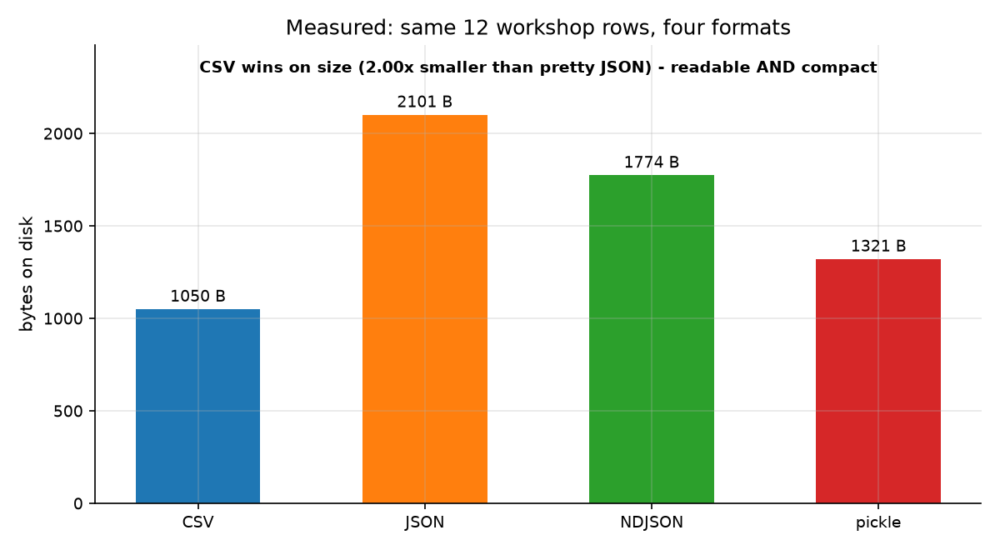
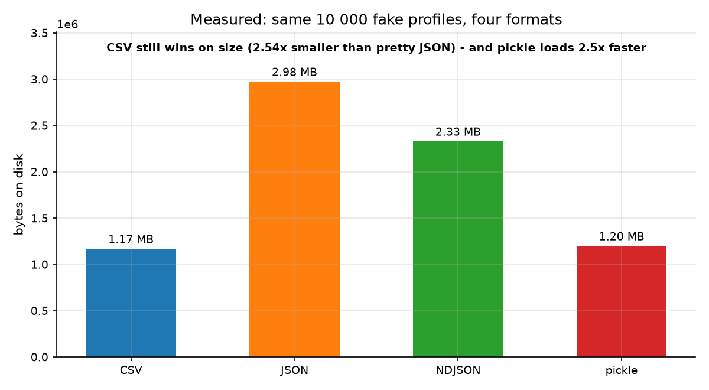
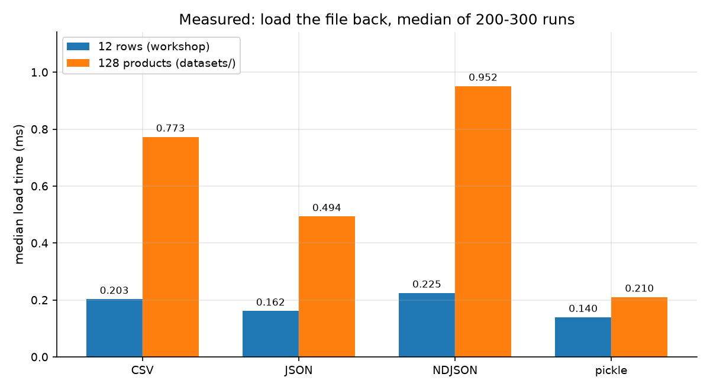
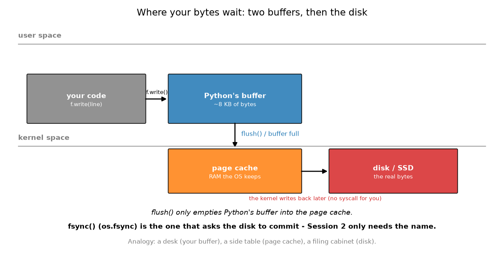
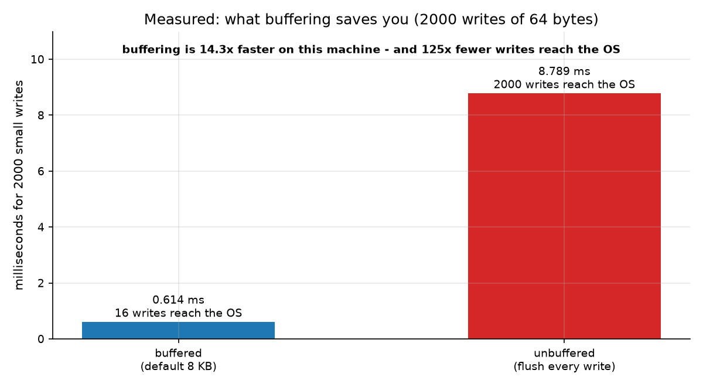
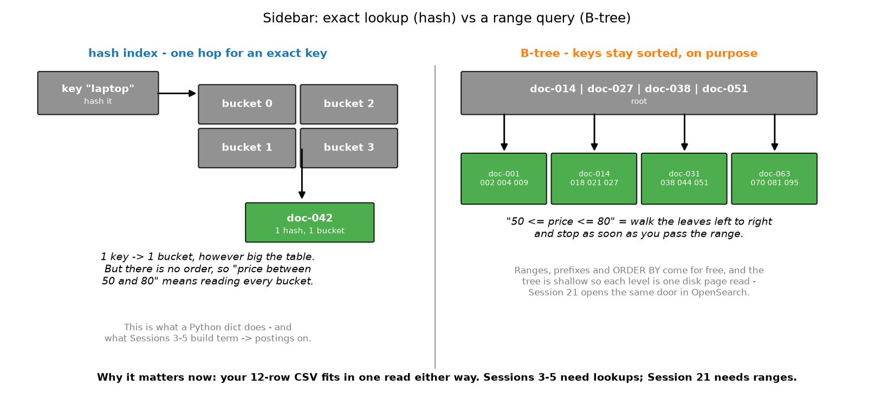

# جلسهٔ دوم — داده‌های دودویی و کار با فایل‌ها در سطح سیستم‌عامل

> در جلسهٔ اول، خواندن فایل‌های متنی را یاد گرفتیم. در این جلسه، قالب فایل‌ها را بررسی می‌کنیم، مسیر حرکت و نگهداری بایت‌ها را دنبال می‌کنیم و می‌بینیم چرا جست‌وجو در یک دیکشنری با پیمایش یک درخت B تفاوت دارد.

## در این جلسه چه می‌آموزیم

* مفهوم **سریال‌سازی (Serialization)**، چرا هر خط لولهٔ داده به آن وابسته است و چگونه Pickle، JSON، CSV و NDJSON هرکدام پاسخ متفاوتی به آن می‌دهند
* تفاوت قالب‌های متنی مانند CSV، JSON و NDJSON با قالب‌های دودویی مانند Pickle — با اندازه‌گیری واقعی روی ۱۲ ردیف و ۱۰٬۰۰۰ پروفایل جعلی
* مقایسهٔ اندازه و سرعت خواندن قالب‌های مختلف بر اساس اندازه‌گیری‌های واقعی
* دو محل نگهداری موقت داده‌ها پیش از رسیدن به دیسک: بافر پایتون و حافظهٔ نهان صفحه‌ای سیستم‌عامل (Page Cache)
* عملکرد واقعی `flush()`، تفاوت آن با `fsync()` و مفهوم توصیف‌گر فایل (File Descriptor)
* آشنایی با نمایهٔ درهم‌سازی (Hash Index) و درخت B (B-tree) و کاربرد هرکدام در جلسه‌های سوم تا پنجم و جلسهٔ بیست‌ویکم

## مفاهیم اصلی

### ۲.۱. سریال‌سازی: تبدیل اشیاء به بایت و برگشت



**سریال‌سازی (Serialization)** فرایند تبدیل یک شیء زندهٔ پایتون (فهرستی از دیکشنری‌ها، یک درخت، یک عدد) به دنباله‌ای از **بایت‌ها** است که بتوان آن‌ها را در یک فایل ذخیره کرد یا از طریق شبکه ارسال کرد و **دی‌سریال‌سازی (Deserialization)** سفر برعکس است. هر بار که مدلی را ذخیره می‌کنی، نقطهٔ بازیابی خزش را می‌نویسی یا رکوردی را از یک سرویس به سرویس دیگر می‌فرستی، داری سریال‌سازی می‌کنی. قالبی که انتخاب می‌کنی سه چیز را تعیین می‌کند: بایت‌ها چقدر **کوچک** باشند، چقدر **سریع** بارگذاری شوند و آیا **ابزارهای دیگر** بتوانند آن‌ها را بخوانند یا نه. تشبیه: سریال‌سازی **بسته‌بندی چمدان** است؛ می‌توانی همه‌چیز را صاف و تخت بچینی (CSV)، روی چوب لباسی اصلی نگه داری (Pickle) یا فهرست‌نامه‌ای بنویسی تا غریبه‌ها بتوانند دوباره بسته‌بندی کنند (JSON). **اصطلاحات کلیدی:** سریال‌سازی، دی‌سریال‌سازی، قالب، رفت‌وبرگشت (Round Trip).

سه خانواده که در این دوره با آن‌ها آشنا می‌شوی: قالب‌های **خودتوصیف** (JSON، CSV؛ فایل خودش نام ستون‌ها را دارد، پس هر ابزاری می‌تواند آن را بخواند)، قالب‌های **وابسته به زبان** (Pickle؛ فقط پایتون می‌فهمد، اما انواع دقیق داده را حفظ می‌کند) و قالب‌های **ستونی** (Parquet، `.npy` نامپای؛ برای ماتریس‌ها و تحلیل‌ها بهینه‌شده‌اند و در جلسه‌های ۷ و ۱۲ دوباره می‌بینیم).

### ۲.۲. قالب‌های متنی: CSV، JSON و NDJSON



**قالب داده (Data Format)** مجموعه‌ای از قواعد است که مشخص می‌کند هر دنباله از بایت‌ها چگونه تفسیر شود. در این دوره با سه قالب متنی پرکاربرد آشنا می‌شوی:

* **CSV:** هر سطر یک رکورد است، مقادیر با ویرگول از یکدیگر جدا می‌شوند و هر مقداری که ویرگول داخل داشته باشد داخل علامت نقل‌قول قرار می‌گیرد.
* **JSON:** داده‌ها را با ساختارهای `{ }` و `[ ]` و جفت‌های `"key": value` نمایش می‌دهد و از ساختارهای تو‌در‌تو پشتیبانی می‌کند.
* **NDJSON:** همان اشیاء اما یکی در هر خط، بدون آرایهٔ دربرگیرنده؛ پس می‌توان فایلی با میلیارد ردیف را خواند بدون اینکه همه‌اش را یک‌جا بارگذاری کرد.

نمودار بالا روی ۱۰٬۰۰۰ پروفایل جعلی که در کارگاه تولید می‌کنی اندازه‌گیری شده است: CSV برابر با ۱٬۱۷۰٬۲۷۰ بایت، Pickle برابر با ۱٬۲۰۰٬۴۵۶ بایت، NDJSON برابر با ۲٬۳۳۰٬۲۸۲ بایت و JSON برابر با ۲٬۹۷۵٬۰۳۳ بایت. CSV برنده است زیرا هیچ‌چیز را تکرار نمی‌کند؛ NDJSON نام هر کلید را در هر خط تکرار می‌کند و JSON قالب‌بندی‌شده به‌خاطر `indent=2` خط‌ها و فاصله‌های بیشتری دارد. تشبیه: CSV مانند یک **جدول**، JSON مانند یک **کارت اطلاعات** و NDJSON مانند یک **رول رسید** است؛ اطلاعات یکسان‌اند اما کاغذ متفاوت است. **اصطل�احات کلیدی:** CSV، JSON، NDJSON، سریال‌سازی.

توابع پرکاربرد، هرکدام در یک خط. `csv.DictReader(f)` یک فایل CSV را می‌خواند و هر ردیف را به‌صورت یک دیکشنری برمی‌گرداند که نام ستون‌ها از سطر عنوان گرفته می‌شود. `csv.DictWriter(f, fieldnames=...)` ردیف‌ها را با ترتیب ستون‌های تعیین‌شده می‌نویسد. `json.dump(obj, f, indent=2)` یک شیء را در فایلی که خودت باز کردی می‌نویسد. `json.dumps(obj)` به‌جای نوشتن در فایل، یک **رشته** برمی‌گرداند. مقادیر پرکاربرد: `indent=2` (خوانا)، `indent=None` (یک خط بلند)، `ensure_ascii=False` (نویسهٔ `é` را به‌جای `é` نگه می‌دارد). `newline=""` در `open()` برای CSV به معنای «پایان خط را ترجمه نکن» است.

یک نکتهٔ صادقانه دربارهٔ CSV که در نمودار می‌بینی: **CSV نوع داده ندارد**. مقدار `19.99` به‌صورت رشتهٔ `"19.99"` برمی‌گردد، پس خودت باید تبدیلش کنی. JSON انواع `int` و `float` و `list` را حفظ می‌کند و Pickle همه‌چیزی را که پایتون می‌داند حفظ می‌کند.

### ۲.۳. قالب‌های دودویی: Pickle، `struct` و `np.save`



قالب‌های دودویی داده‌ها را به‌جای ارقام در قالب متن، به‌صورت بایت خام ذخیره می‌کنند؛ پس هنگام خواندن همهٔ مراحل تجزیه حذف می‌شود. سه قالب که در این دوره می‌بینی:

**۱. Pickle** — سریال‌ساز اختصاصی پایتون؛ تنها قالبی که انواع دقیق و ساختارهای تو‌در‌تو را حفظ می‌کند.

**۲. `struct`** — چیدمان بایت‌ها را خودت تعریف می‌کنی:

```python
struct.pack("!i f 8s", 7, 19.99, b"p-001")
```

این دستور دقیقاً ۱۶ بایت است و تنها راه نوشتن رکورد با عرض ثابت است که بتوان داخل فایل به موقعیت‌های مشخص پرید.

**۳. `np.save`** — قالب `.npy` نامپای؛ یک سرآیند متنی کوتاه و سپس یک بلوک پیوسته از بایت‌های آرایه. خانهٔ مناسب ماتریس TF-IDF در جلسهٔ هفتم است.

نمودار این بخش بر اساس میانهٔ ۲۰۰ تا ۳۰۰ بار اندازه‌گیری تهیه شده است. طبق اعداد گزارش‌شده، بارگذاری ۱۲۸ محصول با Pickle حدود ۰٫۲۱ میلی‌ثانیه و با CSV حدود ۰٫۷۷ میلی‌ثانیه زمان برده است؛ یعنی Pickle حدود ۳٫۷ برابر سریع‌تر بوده است. در عین حال، CSV با اندازهٔ ۱۶٬۷۴۲ بایت در برابر ۱۹٬۷۴۲ بایت برای Pickle، فایل کوچک‌تری تولید کرده است. تشبیه: قالب متنی مانند **نامهٔ فکس‌شده** است (فشرده و جهانی) و قالب دودویی مانند **جملهٔ گفته‌شده** (برای کسانی که از قبل آنجا هستند فوری است). **اصطلاحات کلیدی:** Pickle، `struct`، `np.save`، رفت‌وبرگشت داده.

یک خط برای هرکدام، با آنچه واقعاً اتفاق می‌افتد. `pickle.dump(rows, f)` نمودار اشیاء را می‌پیماید، برچسب نوع و بایت‌ها را می‌نویسد و چیزی برنمی‌گرداند؛ کار در فایل است. `struct.pack(fmt, *values)` بایت برمی‌گرداند؛ `struct.unpack(fmt, data)` یک تاپل برمی‌گرداند؛ رشتهٔ قالب همان چیدمان است و `!` به معنای «اندازه‌های استاندارد، بدون فاصلهٔ هم‌ترازی» است. `np.save(path, array)` فایل `.npy` می‌نویسد (پسوند را خودت بده یا نامپای آن را اضافه می‌کند). نکتهٔ مشترک هر سه: فایل دودویی **به کدی که نوشتش وابسته است**. Pickle یک نمونهٔ کلاس اگر کلاس جابه‌جا شود شکست می‌خورد؛ چیدمان `struct` اگر رشتهٔ قالب را جابه‌جا کنی شکست می‌خورد. فایل‌های متنی از این شرایط جان سالم به در می‌برند. هرگز Pickle غریبه را باز نکن؛ `pickle.load` می‌تواند کد اجرا کند.

### ۲.۴. بایت‌ها کجا منتظر می‌مانند؟ بافر پایتون و Page Cache



وقتی `f.write("hello")` را صدا می‌زنی، بایت‌ها **نمی‌روند روی دیسک**. در بافر خود پایتون فرود می‌آیند؛ چند کیلوبایت رم کنار شیء تو که آنجا می‌مانند تا بافر پر شود، `flush()` صدا زده شود یا `close()` فراخوانی شود. فقط آن‌وقت به **حافظهٔ نهان صفحه‌ای (Page Cache)** هسته می‌رسند؛ قفسهٔ اندازهٔ رمِ سیستم‌عامل از بلوک‌های دیسکِ اخیراً استفاده‌شده. دیسک سومین ایستگاه است و سیستم‌عامل بر اساس برنامهٔ خودش به سراغ آن می‌رود، بدون هیچ فراخوانی از سمت تو. تشبیه: **میز** (بافر تو) ← **میز کناری** (Page Cache) ← **کمد بایگانی** (دیسک)؛ کاغذها را به میز کناری می‌سپاری و فراموششان می‌کنی. **اصطلاحات کلیدی:** بافر (Buffer)، حافظهٔ نهان صفحه‌ای (Page Cache)، تخلیهٔ بافر (Flush)، فراخوانی سیستمی (System Call).

به همین دلیل خواندن فایل برای دومین بار فوری است؛ همهٔ اندازه‌گیری‌های جلسهٔ سوم روی حافظهٔ نهان گرم اجرا می‌شوند و اعداد فقط به همین دلیل صادقانه‌اند که هر قالب همان گرم‌کردن اولیه را می‌گیرد. دو تابع کاربردی دیگر: `os.path.getsize(path)` اندازهٔ فایل را برحسب **بایت** برمی‌گرداند بدون اینکه چیزی بخواند؛ فقط از سیستم‌عامل دربارهٔ اطلاعات فایل می‌پرسد. `os.makedirs(path, exist_ok=True)` پوشه را می‌سازد (اگر از قبل وجود داشته باشد کاری نمی‌کند) تا نوشته‌هایت جایی برای فرود داشته باشند.

### ۲.۵. تفاوت `flush()` و `fsync()` و مفهوم File Descriptor



`flush()` دقیقاً یک کار می‌کند: **بافر پایتون را به سیستم‌عامل تحویل می‌دهد**. به دیسک نمی‌رساند. `os.fsync(f.fileno())` همان کسی است که از دیسک می‌خواهد متعهد شود و گران است؛ به همین دلیل پایگاه‌های داده و نویسندگان گزارش با دقت انتخاب می‌کنند. در آزمایش گزارش‌شده برای این سیستم، ۲۰۰۰ عملیات نوشتن با اندازهٔ ۶۴ بایت نتایج زیر را داشته‌اند:

* بافرگذاری پیش‌فرض ۸ کیلوبایتی: حدود ۰٫۶۱۴ میلی‌ثانیه؛ تقریباً ۱۶ عملیات نوشتن به سیستم‌عامل رسید.
* بدون بافرگذاری: حدود ۸٫۷۸۹ میلی‌ثانیه؛ هر ۲۰۰۰ عملیات به سیستم‌عامل رسید.

یعنی حالت بدون بافر حدود ۱۴٫۳ برابر کندتر بوده است و این فقط هزینهٔ فراخوانی سیستمی است، پیش از هر کار دیسکی. تشبیه: `flush()` تحویل نامه به **صندوق خروجی** است؛ `fsync()` تماشای خروج پیک از ساختمان. **اصطلاحات کلیدی:** `flush()`، `fsync()`، فراخوانی سیستمی، توصیف‌گر فایل.

**توصیف‌گر فایل (File Descriptor)** عدد صحیح کوچکی است که سیستم‌عامل هنگام باز کردن فایل به تو می‌دهد؛ `3`، `7`، `1024`، هر عددی که آزاد باشد و هر خواندن و نوشتن از طریق همان عدد انجام می‌شود. `open()` یک شیء فایل پایتون می‌سازد که توصیف‌گر را در بر می‌گیرد و `f.fileno()` آن را آشکار می‌کند. کل ماجرا همین است: یک فایل باز، عددی در جدول است و `close()` جای را آزاد می‌کند. هر فایلی که سیستم‌عامل به هر حال لازم دارد؛ ورودی استاندارد، خروجی استاندارد و خطای استاندارد؛ توصیف‌گر ۰، ۱ و ۲ را دارند و به همین دلیل `sys.stdout` همیشه می‌تواند بسته و باز شود.

کاربرد واقعی `flush()` که در کارگاه می‌سازیم: **تعقیب زندهٔ گزارش**. `tail -f app.log` فقط خطوطی را می‌تواند نشان دهد که از بافر پایتون خارج شده باشند، پس حلقهٔ ثبت گزارش باید در حین نوشتن `flush()` کند نه منتظر `close()` بماند.

### ۲.۶. نمایهٔ درهم‌سازی در برابر درخت B



دو روش برای یافتن یک کلید در انبوهی از کلیدها که هرکدام برای کار خاصی مناسب‌ترند. **نمایهٔ درهم‌سازی (Hash Index)** کلید را از تابع درهم‌سازی می‌برد، شمارهٔ سطل را به دست می‌آورد و مستقیم به آنجا می‌پرد؛ یک پرش مهم نیست جدول چقدر بزرگ است (O(1)). **درخت B (B-tree)** کلیدها را **مرتب** در یک درخت کم‌عمق و دیسک‌شکل نگه می‌دارد؛ یافتن کلید چند پرش می‌برد (O(log n)) اما چون کلیدها به ترتیب هستند، «همه‌چیز بین ۵۰ و ۸۰»، «همه‌چیز که با `lap` شروع می‌شوند» و «ردیف‌ها را به ترتیب شناسه بده» تقریباً رایجان پاسخ داده می‌شود. این ویژگی دوم همان چیزی است که پایگاه‌های داده و موتورهای جست‌وجو روی آن ساخته شده‌اند. تشبیه: نمایهٔ درهم‌سازی مانند **رخت‌آویز با شماره** است؛ فوری است اما ترتیب ندارد. درخت B مانند **قفسه‌های الفبایی کتابخانه** است؛ چند قدم طولانی‌تر اما می‌توانی بازه را را بروی. **اصطلاحات کلیدی:** نمایهٔ درهم‌سازی (Hash Index)، درخت B (B-tree)، جست‌وجوی کلید (Lookup)، پرس‌وجوی بازه‌ای (Range Query).

چرا امروز برای ما مهم است: CSV دوازده‌ردیفی در هر دو حالت یک خواندن جا می‌شود، پس انتخاب قالب دربارهٔ انسان‌ها و اندازهٔ فایل است نه سرعت. جلسه‌های سوم تا پنجم سمت درهم‌سازی را می‌سازند (`واژه ← فهرست اسناد`، دقیقاً یک دیکشنری پایتون). جلسهٔ بیست‌ویکم سمت درخت B را در OpenSearch باز می‌کند که پرس‌وجوی بازه‌ای عددی و نتایج مرتب از پیش‌نیازهای آن است.

## مثال عملی — تبدیل CSV به JSON و Pickle

در این مثال، فایل CSV را با ماژول `csv` می‌خوانیم، داده‌ها را به JSON و Pickle تبدیل می‌کنیم و سپس اندازهٔ فایل‌های تولیدشده را مقایسه می‌کنیم. کد را از پوشهٔ اصلی کارگاه اجرا کنید. نکتهٔ جدید این است که `open(..., mode="wb")` حالت **باینری** است (بدون رمزگشایی) که Pickle به آن نیاز دارد.

```python
import csv, json, os, pickle

rows = []
f = open("workshop/data/records.csv", mode="r", encoding="utf-8", newline="")
for row in csv.DictReader(f):
    rows.append(row)
f.close()
f = open("out_a.json", mode="w", encoding="utf-8", newline="")
json.dump(rows, f, indent=2)
f.close()
f = open("out_a.pkl", mode="wb")
pickle.dump(rows, f)
f.close()
print("rows:", len(rows))
print("first name:", rows[0]["name"], "| price type:", type(rows[0]["price"]).__name__)
print("comma survived:", rows[11]["name"])
print("json bytes:", os.path.getsize("out_a.json"))
print("pickle bytes:", os.path.getsize("out_a.pkl"))
```

### خروجی گزارش‌شده از اجرای واقعی

```text
rows: 12
first name: Desk Lamp | price type: str
comma survived: Cable, 3-pack
json bytes: 2100
pickle bytes: 1321
```

دو نکته که باید ببینی: `"Cable, 3-pack"` سالم باقی مانده است زیرا `csv` آن را داخل نقل‌قول می‌گذارد و `price type: str` یعنی CSV متن به تو داده است نه عدد.

## آماده‌سازی محیط اجرا

محیط مجازی دوره را مطابق راهنمای `README.md` فعال کنید و دستورهای این جلسه را از پوشهٔ مربوط به آن اجرا کنید. در این جلسه به کتابخانه‌های استاندارد پایتون، از جمله `csv`، `json`، `pickle`، `struct`، `os` و `time` نیاز داریم و برای اجرای `images/make_images.py` به `matplotlib` نیاز خواهیم داشت. بدون pandas، بدون شبکه.

## ارتباط این مفاهیم با کارگاه عملی

در متن آموزشی جلسه، چهار قالب داده را در کنار یکدیگر بررسی کردیم. در کارگاه عملی، این مقایسه را با اجرای برنامه انجام خواهیم داد. ایستگاه اول `records.csv` را به‌شکل صحیح می‌خواند. ایستگاه‌های دوم و سوم همان ۱۲ ردیف را در قالب‌های CSV، JSON، NDJSON و Pickle ذخیره می‌کنند. ایستگاه چهارم ۱۰٬۰۰۰ پروفایل جعلی تولید می‌کند و اندازه‌های آن‌ها را مقایسه می‌کند. ایستگاه پنجم زمان بارگذاری را اندازه‌گیری و جدول نتایج را چاپ می‌کند. ایستگاه ششم با `flush()` گزارشی می‌نویسد که ابزار تعقیب زنده بتواند دنبالش کند. هر عددی که تولید می‌کنی همان عددی است که در نمودار بالا می‌بینی.

## خطاهای رایج

* **باز کردن فایل Pickle با `mode="w"`:** Pickle به `mode="wb"` نیاز دارد وگرنه خطای `TypeError: a bytes-like object is required` می‌گیری.
* **باز کردن فایل Pickle با `mode="r"`:** باید `"rb"` باشد. خواندن Pickle در حالت متنی همان‌طور شکست می‌خورد.
* **فراموش کردن `newline=""` در `open()` برای CSV:** روی ویندوز کار می‌کند اما اندازهٔ بایت و پایان خط را در لینوکس تغییر می‌دهد.
* **انتظار دریافت اعداد از CSV:** `19.99` رشتهٔ `"19.99"` است؛ خودت باید `float(...)` را صدا بزنی.
* **تصور اینکه `flush()` یعنی ذخیره روی دیسک:** `flush()` یعنی تحویل به سیستم‌عامل. `os.fsync()` همان کسی است که دیسک را ظاهراً می‌کند.
* **باز کردن Pickle غریبه:** دی‌سریال‌سازی می‌تواند کد اجرا کند. فقط فایل‌هایی را باز کن که خودت نوشتی.

## آزمون خودارزیابی

۱. «سریال‌سازی» چه معنایی دارد و انتخاب قالب چه سه چیزی را تعیین می‌کند؟

۲. در اندازه‌گیری فایل ۱۲ ردیفی این جلسه، کدام قالب کوچک‌ترین فایل را تولید کرد و کدام قالب سریع‌تر بارگذاری شد؟

۳. `flush()` دقیقاً چه کاری انجام می‌دهد و چه کاری انجام نمی‌دهد؟

۴. اگر `pickle.dump(rows, f)` را روی فایلی اجرا کنی که با `mode="w"` باز شده است، چه اتفاقی می‌افتد و چرا؟

۵. چرا نمایهٔ درهم‌سازی برای پیدا کردن `doc-042` بهتر از درخت B عمل می‌کند، اما درخت B برای «قیمت بین ۵۰ و ۸۰» بهتر است؟

### پاسخ‌ها

۱. سریال‌سازی تبدیل یک شیء زندهٔ پایتون به بایت برای ذخیره‌سازی یا انتقال است و دی‌سریال‌سازی برعکس آن. قالب اندازه، سرعت بارگذاری و خوانایی توسط ابزارهای دیگر را تعیین می‌کند.

۲. کوچک‌ترین فایل: **CSV، ۱۰۵۰ بایت**. سریع‌ترین بارگذاری: **Pickle** (میانهٔ ۰٫۱۴ میلی‌ثانیه روی ۱۲ ردیف و ۰٫۲۱ میلی‌ثانیه روی ۱۲۸ محصول، در برابر ۰٫۷۷ میلی‌ثانیه برای CSV).

۳. بافر پایتون را به حافظهٔ نهان صفحه‌ای سیستم‌عامل تحویل می‌دهد. داده را **روی دیسک پایدار نمی‌کند**؛ آن کار `os.fsync()` است.

۴. با خطای `TypeError: a bytes-like object is required` شکست می‌خورد (نه `'str'`) زیرا Pickle بایت می‌نویسد و حالت متنی فقط رشته می‌پذیرد. باید با `mode="wb"` باز شود.

۵. درهم‌سازی مستقیم به یک سطل محاسبه‌شده می‌پرد (O(1)) اما کلیدها را بدون ترتیب نگه می‌دارد، پس بازه یعنی پویش همهٔ سطل‌ها. درخت B کلیدها را مرتب نگه می‌دارد، پس بازه یک پیمایش مرتب کوتاه است که می‌تواند زود متوقف شود.

## گام بعدی

[→ شروع کارگاه عملی](workshop/WORKSHOP.md)
