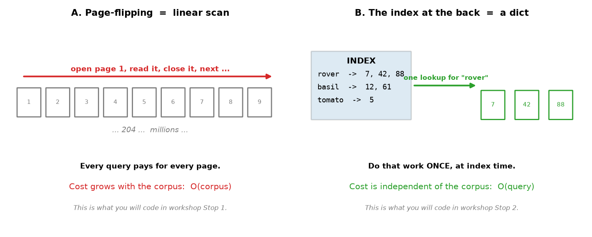
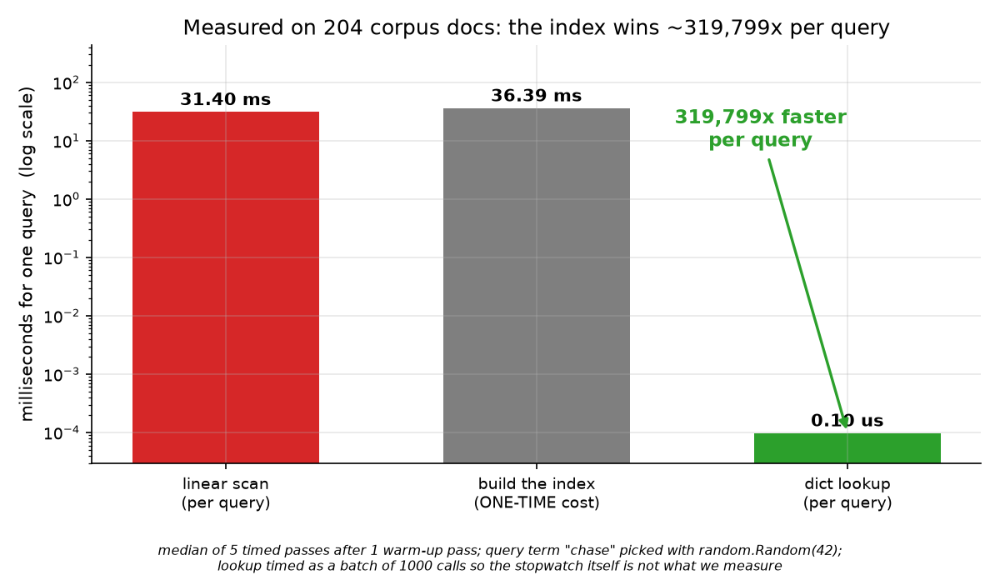
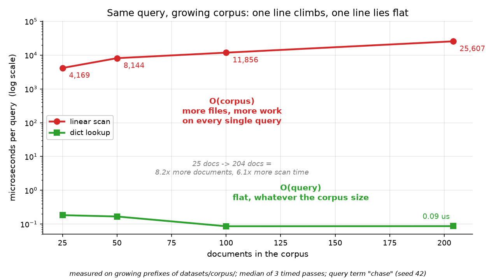

# Session 03 — Naive Search & the Idea of Indexing
> Session 1 taught you to open a file. Today you open two hundred — and discover why no search engine on earth ever does that twice.

## What you'll learn
- The one question every search engine exists to answer, and the two ways to answer it
- What a **linear scan** is, why it is honest and obvious, and why it is hopeless
- How to build a `{term: [filenames]}` dictionary in one pass and answer a query with a single lookup
- What **O(corpus)** vs **O(query)** actually means, with measured numbers from the real corpus
- Why the dictionary you are about to write is one small step away from a real inverted index

## Concepts

### 03.1 One question, two strategies

A search engine does exactly one thing: given a **query** ("rovers"), return the
documents that contain it. There are only two strategies. Either you **scan**
every document in the **corpus** every single time a question arrives — read
page 1, read page 2, read page 3 — or you do that reading work *once* and write
the answers down somewhere you can jump to. Analogy: to find a friend in a
stadium you either walk every row, or you look at the section numbers on the
tickets and walk straight to the right block. Key terms: **corpus**, **query**,
**scan**, **index**.

Both strategies return *the same answers*. The entire game is which one you pay
for, and when.

### 03.2 Strategy A — the linear scan

The **linear scan** is the honest, obvious, five-line version: take the list of
files, and for each one open it, split it into **tokens** (words), and ask
"is my term in here?". Repeat that for every query that ever arrives. The red bar
above is measured, not imagined: on our 204-document corpus — files of about 270
bytes each, small enough to read in one glance — **one query costs 31.4 ms**.
That is the entire price of one search: the whole collection, re-read from
scratch. (Every number in this README and in these charts comes from one real
`python images/make_images.py` run on the machine described under *Environment*;
rerun it and your milliseconds will differ.) Analogy: answering "where is my
keys?" by re-reading every book in the house. Key terms: **linear scan**,
**token**, **whole-word match**, **O(corpus)**.

Note the middle bar while you are here: building the index costs about the same
as *one* scan (36.4 ms). That is the price of admission, and you pay it once.

### 03.3 Strategy B — the dictionary

So read every file **once**, and while you are already holding it, write down
what you saw: for every word, which files contained it. The result is a plain
Python **dict** — the most ordinary object in the language:

```python
{"python": ["doc-a.txt", "doc-c.txt"], "shot": ["doc-b.txt"], ...}
```

Afterwards a query is not a search at all, it is a **lookup**: hand the dict the
term, get the list back. Measured on the same corpus, that is **0.098 µs** —
about 320,000 times faster than the scan. Analogy: the index at the back of the
book. Key terms: **dict**, **lookup**, **index time**, **query time**.

The catch is honest and worth saying out loud: building the dict means reading
every file once, so indexing is not free — it is *the same work as one scan*,
moved earlier in time. You are not magicing work out of nothing. You are
converting a per-query cost into a one-time cost.

### 03.4 O(corpus) vs O(query): how the work *grows*

The **O(...)** notation is not maths gymnastics — it is just the answer to "what
happens when I get **more** documents?". Read the chart: going from 25 to 204
documents — roughly 8× more data — makes the red scan line roughly 8× slower.
Double the corpus, double the wait. That is **O(corpus)**: the work grows *with
the collection*. The green line, over exactly the same range, stays flat on the
floor at a few hundred nanoseconds. That is **O(query)**: the work grows with
*your question*, and a one-word question does not get harder because the library
grew. Analogy: sweeping the floor is O(rooms); checking whether you already own
a book title is O(1). Key terms: **complexity**, **O(corpus)**, **O(query)**,
**one-time cost**.

This is the single most important idea in the course. Google did not become fast
by writing a cleverer loop; it became fast by paying a fixed price up front so
that every future question is cheap.

### 03.5 This dict is one step away from an inverted index
![From {term: [filenames]} to document ids to postings lists](images/03-04-bridge-to-inverted-index.png)
Look hard at what you just built: a mapping from a **term** to the documents
that contain it. If you stop storing filenames and store **document ids**, and
then also remember *how many times* the term occurred in each one, you get a
**term frequency**. That object — term → `(document id, count)` pairs — is a
**postings list**, and the whole collection of them is an **inverted index**.
It is the data structure behind every lexical search engine that has ever
existed, and Session 5 is nothing more than adding those two hops to the dict
you write in this workshop. Analogy: you have already built a phone book; the
index also records *how often* you call each person. Key terms: **document id**,
**term frequency**, **postings list**, **inverted index**.

## Worked example

Six pretend documents, one per line of `workshop/data/sample_notes.txt`. Build
the dictionary the index way, then check line by line the naive way, and compare.
New idea in one line: `.split("\n")` cuts a string into a **list of lines**, and
`"a" + "b"` glues text together (str() is needed to glue a number or a list).

```python
f = open("workshop/data/sample_notes.txt", mode="r", encoding="utf-8")
docs = f.read().strip().split("\n")     # one line = one tiny "document"
f.close()
term = "python"
index = {}                              # term -> which lines mention it
for i in range(len(docs)):
    for word in docs[i].lower().split():
        word = word.strip(":.,!?")
        if word not in index:
            index[word] = [i]
        elif index[word][-1] != i:
            index[word].append(i)
scan = []                               # the naive way: check line by line
for i in range(len(docs)):
    for raw in docs[i].lower().split():
        if raw.strip(":.,!?") == term:
            scan.append(i)
print("linear scan:", scan)
print("dict lookup:", index[term])
print("same answer:", scan == index[term])
```

Actual output (pasted from a real venv run):

```
linear scan: [0, 2, 4]
dict lookup: [0, 2, 4]
same answer: True
```

Both strategies found lines 0, 2 and 4 — the three lines that mention *python* —
and they agree. That agreement is the only thing that makes the speedup worth
anything.

## Environment (venv)

Set up the course venv once (see **Environment setup** in the main `README.md`),
then activate it every study session; with it active all commands are plain
`python ...`. This session needs only the standard library plus `matplotlib` for
the one chart at the end of the workshop — no network, no models, no downloads.
The timings in the charts were measured on the machine that generated them:
Windows 11, Intel Core Ultra, Python 3.14.7. Rerun `python images/make_images.py`
to re-measure on yours; the microseconds move, the ratio does not.

## How this connects to the workshop

The workshop is the same idea with the training wheels off: four stops that
build the naive scanner, build the dictionary, put a real stopwatch on both, and
ship a report plus the benchmark chart that shows the index winning. Everything
is plain `open()`, `for` loops, `dict`, `list` and `sorted()` — no shortcuts,
because the whole point is to feel how much a twelve-line dict can do.

## Common pitfalls
- Listing the same file twice — if a term appears three times in one document and you append blindly, your index says that document matched three times. The `elif index[word][-1] != name:` guard is the whole fix.
- Matching substrings instead of words: `"art" in text` is also true inside `"cart"`. Compare whole tokens, or the scan and the index will quietly disagree.
- Forgetting `.lower()` and `.strip(punctuation)` — the index stores `"Rovers"` but the query says `"rovers"`, so you get zero results and blame the dict.
- Timing a single dict lookup with `time.perf_counter()`. A lookup is ~0.0001 ms; the stopwatch cannot see it. Time 1,000 lookups and divide.
- Building the index *inside* the query function. Now you pay the one-time cost on every query, and your "index" is slower than the scan that replaced it.

## Self-check quiz
1. Your query is one word. What does a linear scan have to touch before it can answer?
2. The index build costs about as much as one linear scan. Why is it still worth it?
3. What does `O(corpus)` say about a search engine's latency as it indexes more pages?
4. You write `index[word].append(name)` with no duplicate guard. What is wrong, and what does it do to the scan-vs-index comparison?
5. Name the two hops that turn `{term: [filenames]}` into a real inverted index.

<details>
<summary>Answers</summary>

1. Every document in the corpus — it must open and read all of them, because it cannot know where the word is until it looks.
2. Because the scan pays that same cost on *every* query, while the index pays it once. From the second query onward the index is ahead, and the gap widens with every query.
3. That latency grows in step with the collection — adding pages makes every existing search slower. That is exactly why real engines cannot afford brute force.
4. A document containing the term three times gets listed three times. The result set has duplicates, so the two strategies stop agreeing, and the dict looks artificially "better" than it is.
5. (a) store **document ids** instead of filenames, (b) store **how many times** the term occurs in each document — term frequency. Sorted, those pairs are **postings lists** (Session 5).
</details>

## Next
[→ Start the workshop](workshop/WORKSHOP.md)
