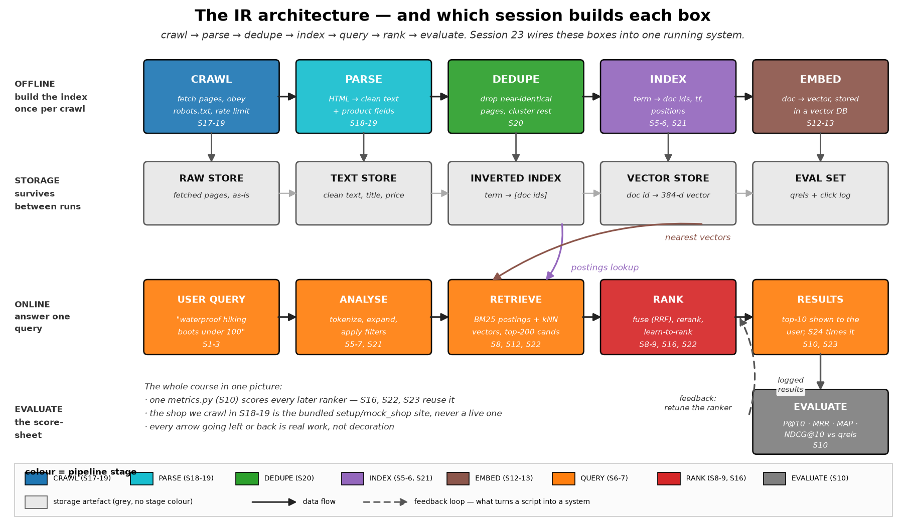
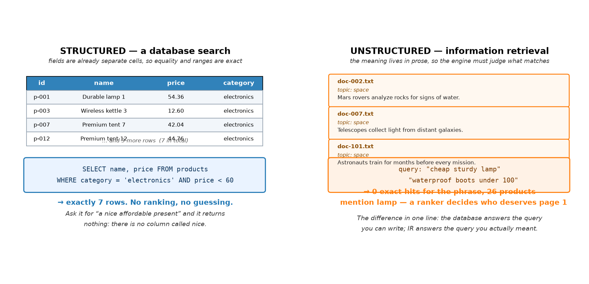
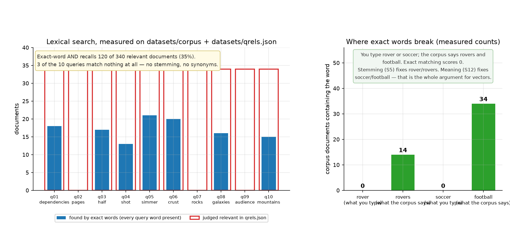
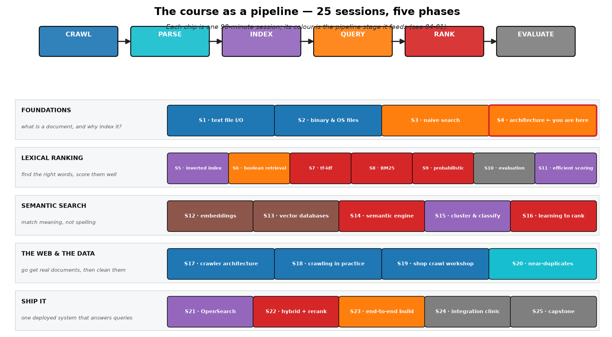

# Session 04 — IR Systems: Architecture
> Before you build any part of a search engine, you need to see the whole machine — today you hold the map that all 21 remaining sessions hang on.

## What you'll learn
- How an IR system differs from a database, and why "SELECT WHERE" cannot answer "soccer boots"
- Structured vs unstructured data, and what each one forces on the machine
- The full pipeline — crawl, parse, dedupe, index, embed, query, rank, evaluate — and where each session plugs in
- Where semantic search attaches to the same architecture
- How to read `images/04-01-ir-architecture.png` and say out loud what every box does

## Concepts

### 04.1 A search engine is a machine with eight moving parts

Every search engine you have ever used — a library catalogue, an online shop,
Google — is the same machine. Nine boxes in the picture above do nine jobs:
**crawl** the documents, **parse** them into fields, **dedupe** copies,
**index** members, **embed** meaning, then answer a **query** by **retrieving**
candidates, **ranking** them, and finally **evaluating** whether the ordering
was any good. Analogy: a hospital. Triage, records, pharmacy, ward, and audit —
each is a separate room with a separate job, and the patient moves between them.
Key terms: **pipeline**, **offline**, **online**, **feedback loop**.

Two halves matter. The top row is **offline**: you build the index once per
crawl and it survives between runs. The bottom row is **online**: you answer one
query, in milliseconds, using what the offline half prepared. Real systems fail
when people mix them up — scraping pages inside a query handler, or embedding
at ranking time. Keep the halves separate and the system stays debuggable
(Session 24 makes a whole clinic out of this).

### 04.2 IR versus a database: SELECT cannot answer "cheap sturdy lamp"

A database stores **structured** data — columns you named in advance, so
`WHERE category = 'electronics' AND price < 60` returns exactly 7 rows and
nothing is a matter of opinion. Free text is **unstructured**: the meaning lives
inside a sentence, so the engine has to judge what matches. In the picture, the
left side has a cell called `category`; the right side has a cell called
`description` containing "A compact kettle for kitchen lovers". Ask the database
for "cheap sturdy lamp" and it returns nothing — there is no `cheap` column.
Analogy: looking up a phone book entry by surname versus describing someone's
face to a sketch artist. Key terms: **structured**, **unstructured**, **exact
match**, **ranked match**.

This is not "database bad, IR good". A search engine that answers "boots under
$100" does structured work on `price` and unstructured work on `boots`, in the
same query. That is exactly why Session 22 exists.

### 04.3 Where semantic search plugs in — same machine, extra box

The architecture does not change shape when you add vectors. You add one
**embed** box and one **vector store**, and the retrieve box gains a second
candidate source. Everything else — parse, evaluate, the online/offline split —
stays identical. That is the good news: Sessions 12-14 add components to a
machine you already understand rather than replacing it.

Now the honest picture of why. The right-hand panel of the image above is
measured from `datasets/corpus/` and `datasets/qrels.json`: a shopper who types
`rover` finds **0** documents, because our corpus only ever writes `rovers`.
Type `soccer` and you find **0** — it only ever writes `football`. These are not
typos; they are how people talk. Stemming in Session 5 fixes the first case.
Meaning fixes the second. Session 12's whole reason for existing is that second
number: `0`.

### 04.4 The course, laid over the machine

This is the map you will keep coming back to. Five phases: foundations (learn
what a document is), **lexical ranking** (find the right words and score them),
**semantic search** (match meaning instead of spelling), **the web and the
data** (go get real documents and clean them), and **ship it** (one deployed
system). The colour of each chip is the stage of 04-01 it feeds. Analogy: a
syllabus is a timetable for a road trip — this picture is the road. Key terms:
**foundations**, **lexical**, **semantic**, **phases**.

One deliberate seam runs through the middle: Session 10's `metrics.py` is the
single scoring truth reused by Sessions 16, 22 and 23. Learn to measure once,
measure everywhere.

## Worked example
Reading the architecture in a way that produces a verdict, not a description
(run from this folder). One new idea: a plain `dict` mapping each box of the
architecture to the sessions that build it.

```python
pipeline = [("CRAWL", "S17-19"), ("PARSE", "S18-19"), ("DEDUPE", "S20"),
            ("INDEX", "S5-6, S21"), ("EMBED", "S12-13"), ("QUERY", "S1-3"),
            ("RANK", "S8-9, S16, S22"), ("EVALUATE", "S10")]
print("boxes:", len(pipeline))
for name, sessions in pipeline[:4]:
    print(f"{name:9s} <- {sessions}")
print("boxes with no session:", [b for b, s in pipeline if s == ""])
```

Actual output (pasted from a real venv run):

```
boxes: 8
boxes with no session: []
CRAWL     <- S17-19
PARSE     <- S18-19
DEDUPE    <- S20
INDEX     <- S5-6, S21
```

Every box is claimed by at least one session. That is what "the course covers
an architecture" means — no orphan requirements.

## Environment (venv)
Set up the course venv once (see **Environment setup** in the main `README.md`),
then activate it every study session; with it active, all commands are plain
`python ...`. This session needs only `matplotlib` plus the Python standard
library, so it runs even on a fresh minimal install.

## How this connects to the workshop
The workshop hands you a scenario brief — you are the new search engineer at a
small outdoor shop — and eight numbered requirements from the shop manager. You
will map each requirement to exactly one box of the architecture above, in code,
and print the annotated diagram as output. Then you verify that your vocabulary
is grounded in real documents by measuring the `rover` / `football` gap yourself.

## Common pitfalls
- Treating the architecture as decoration and skipping straight to code — you then debug a system you never had a picture of.
- Confusing offline and online work: scraping inside the query path, or per-query indexing, is the classic Session 23 slowdown.
- Believing a database subsumes IR because "SQL can do full text" — a `LIKE '%boot%'` has no ranking and gets worse, not better, at scale.
- Announcing "we need embeddings" without showing a failure a ranker cannot fix. The `0` for `soccer` is the argument; "AI" is not.
- Naming boxes instead of data flows — an architecture with no arrows is a parts list.

## Self-check quiz
1. In the 04-01 diagram, which half runs when a user types a query, and which runs once per crawl?
2. Why does `WHERE price < 60` succeed on `price` but fail on `cheap`?
3. Which box of the architecture do Sessions 12-14 add, and which boxes do they leave untouched?
4. Our qrels show exact-word AND recalls 120 of 340 relevant documents for the 10 sample queries. Name the two mechanisms in the diagram that close that gap, and the session each belongs to.
5. What does the dashed arrow from EVALUATE back to RANK represent?

<details>
<summary>Answers</summary>

1. The bottom row (USER QUERY → ANALYSE → RETRIEVE → RANK → RESULTS) runs per query; the top row (CRAWL → PARSE → DEDUPE → INDEX → EMBED) runs once per crawl.
2. `price` is a typed column the database understands and can compare numerically; `cheap` appears nowhere in the schema — there is no column named `cheap`, so SQL cannot filter on it. IR handles it because a ranker judges prose.
3. It adds EMBED and VECTOR STORE, and gives RETRIEVE a second candidate path. It leaves CRAWL, PARSE, DEDUPE, INDEX, QUERY parsing, RANK and EVALUATE structurally unchanged.
4. STEMMING (part of the INDEX / tokenization box, Session 5) fixes `rover`→`rovers`; EMBED (Session 12) fixes `soccer`→`football`. The measured counts in 04-03 are 0 for `rover` and 0 for `soccer`.
5. A feedback loop: evaluation output feeds back into tuning the ranker. Without it, a system never improves once it is deployed — it just runs.
</details>

## Next
[→ Start the workshop](workshop/WORKSHOP.md) — you inherit a shop with eight demands and one architecture to hang them on.
