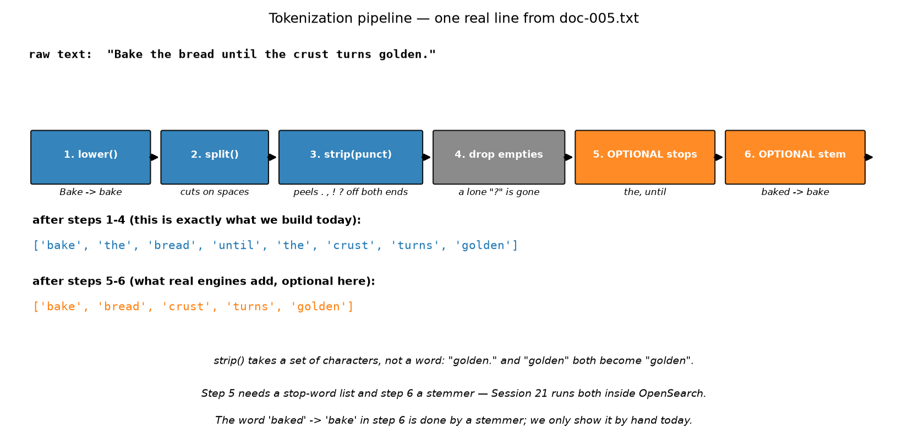
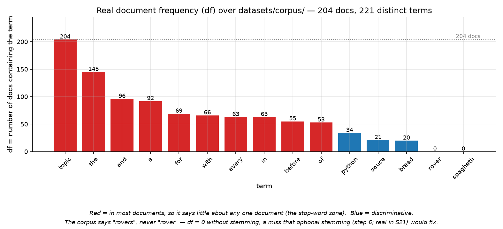
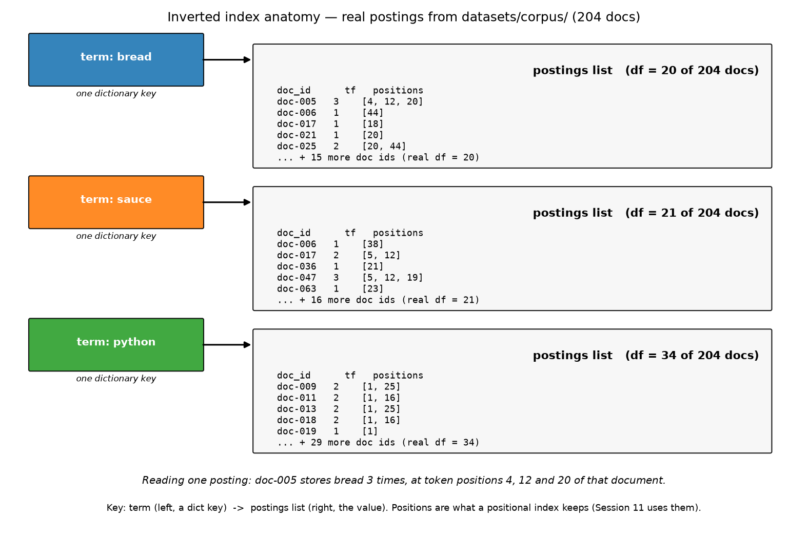
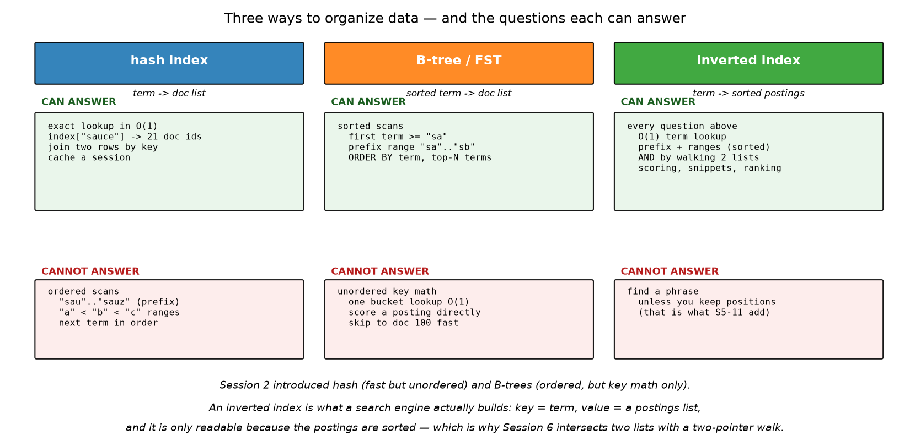

# Session 05 — Inverted Index Construction
> Session 3 built a term→file dictionary. Today you turn that one-term prototype into the data structure every search engine actually ships.

## What you'll learn
- The tokenization pipeline: lowercase → split → strip punctuation → drop empties
- Postings lists, document frequency, and why they must be sorted
- The two index shapes: `{term: [doc_ids]}` and `{term: {doc_id: tf}}`
- Stop words, stemming and lemmas — what they fix, and why they are optional here
- Sidebar: hash index vs B-tree vs inverted index, and what each one cannot answer

## Concepts

### 05.1 Tokenization: text in, terms out

An index is only as good as the terms you put into it, so the first job is
**tokenization**: turn a blob of text into a list of comparable words. Our
pipeline is three method calls — `.lower()` folds case, `.split()` cuts on
whitespace, `.strip(".,!?;:'\"()")` peels punctuation off both ends — then a
skip of anything that came out empty. Analogy: unpacking a delivery — the box
(`text`) is useless until each item is taken out, cleaned, and labelled.
Key terms: **token**, **term**, **normalization**, **PUNCTUATION**.

Note what `.strip(chars)` actually does: it takes a *set of characters*, not a
word. `"golden."` and `"golden"` both become `"golden"` — and a lonely `"?"`
becomes the empty string, which is why we drop it.

One decision, stated plainly: **we index every line of the file, including the
`topic: <name>` metadata line.** That is why `topic` has df = 204 in the real
corpus. Real engines separate fields (a title field, a body field) and weight
them differently — that is a Session 4/21 concern, not a Session 5 one.

### 05.2 Stop words, and why the index is mostly stop words

A **stop word** is a word so common it says nothing about any one document:
`the`, `and`, `a`, `of`. The chart is measured from `datasets/corpus/` — `the`
appears in 145 of 204 documents, while `sauce` appears in 21. Indexing them
costs space and pollutes results, so engines normally keep a stop list and drop
them. Analogy: sorting the mail by "a letter was sent to you" is technically
true and completely useless; the postcode is what narrows it down. Key terms:
**stop word**, **document frequency (df)**, **discriminative**.

We do **not** apply a stop list today — on purpose. Keeping `the` in the index
lets you see it in the postings lists and compare it with `sauce`, which is
more instructive than silently deleting it. You will add stop words as a
stretch goal in the workshop.

### 05.3 Stemming and lemmatization (shown by hand, not required)

`running`, `runs`, `ran` are three keys that should ideally find the same
document. **Stemming** chops words back to a shared root (`running` → `run`,
`baked` → `bake`) with crude rules; **lemmatization** maps a word to its real
dictionary form (`better` → `good`, `was` → `be`) using a vocabulary. The chart
above shows a real consequence: our corpus says `rovers`, never `rover`, so a
query for `rover` returns df = 0 until a stemmer merges them. Analogy: three
spellings of the same person's name should hit one mailbox. Key terms:
**stem**, **lemma**, **root**.

Both need a word list or a rule set (NLTK, spaCy, Snowball, or the analyzer
inside OpenSearch), so they are **optional in Session 5** — real engines run
them as pipeline steps 5 and 6, and Session 21 shows OpenSearch doing exactly
this. Nothing in today's workshop depends on them.

### 05.4 Postings lists, tf, and positions — the anatomy

An **inverted index** turns the document→words direction around: instead of
"doc-005 contains bread", it stores "bread lives in doc-005, doc-006,
doc-017…". Each of those doc ids is one **posting**, and the whole list is a
**postings list**. Attach a count to each posting and you get **tf**, the term
frequency — how many times the term occurs in that one document
(`doc-005 tf=3` for `bread`). Attach the positions too and you have a
**positional index**, which is what lets a search engine answer "were these two
words next to each other?" — Session 11 uses positions for phrase queries.
Analogy: a book's index at the back maps "bread" → pages 44, 51, 88, instead of
you flipping through every chapter. Key terms: **inverted index**,
**postings list**, **posting**, **tf**.

The diagram is not a sketch: those doc ids, tf values and position numbers come
straight from `datasets/corpus/`. `bread` really does live in 20 of the 204
documents, and it really does appear three times in `doc-005`, at token
positions 4, 12 and 20.

### 05.5 Sidebar: hash index vs B-tree vs inverted index

Session 2 gave you two containers. A **hash index** answers "what is stored under
key X?" in constant time but keeps no order, so it can never answer "give me
everything from `sa` to `sb`". A **B-tree** keeps keys sorted and can walk
ranges and prefixes, but it is a way to *find rows*, not a way to *think about
documents*. The **inverted index** is what a search engine builds: the key is a
term, the value is a postings list, and — this is the part that matters — the
postings are sorted by doc id. Sorted postings are what let Session 6 intersect
two lists with a two-pointer walk, and what let `ORDER BY` style top-N work.
Analogy: a hash table is a coat check with numbered tags (instant, unordered);
a B-tree is the same rack filed alphabetically; the inverted index is that rack
with a note on every hanger listing the page numbers. Key terms: **hash index**,
**B-tree**, **sorted postings**.

## Worked example

Here is the entire idea in twenty lines: tokenize three tiny documents and fill
a dict of postings lists (run it from this folder, `session-05-inverted-index/`):

```python
def tokenize(text):
    out = []
    for raw in text.lower().split():
        w = raw.strip(".,!?;:'\"()")
        if w != "":
            out.append(w)
    return out

index = {}
for doc_id in ["doc-a", "doc-b", "doc-c"]:
    f = open("workshop/data/" + doc_id + ".txt", encoding="utf-8")
    for term in tokenize(f.read()):
        if term not in index:
            index[term] = []
        if doc_id not in index[term]:
            index[term].append(doc_id)
    f.close()
print("terms:", len(index))
print("index ->", index["index"])
print("term  ->", index["term"])
```

Actual output (pasted from a real venv run):

```
terms: 37
index -> ['doc-a', 'doc-b']
term  -> ['doc-a', 'doc-b']
```

Read it by hand against the three files in `workshop/data/`: `index` really does
appear in `doc-a` and `doc-b` and nowhere else, and 37 distinct terms survive
tokenization across the three documents.

## Environment (venv)

Activate the course venv before anything else (one-time setup lives in the main
`README.md`); with it active every command below is plain `python ...`. This
session needs nothing beyond the standard library — the images were generated
with `matplotlib`, but your workshop code is pure Python: `open()`, `for` loops,
plain `dict`/`list`, `sorted()`.

## How this connects to the workshop

The workshop rebuilds this from an empty file in four stops: tokenize, then list
the docs, then build the v1 index, then add tf and answer AND queries. You work
on a 3-document mini-corpus in `workshop/data/` so every number can be checked
by hand, then aim the finished tool at the real 204-document corpus. The final
stop adds `search_and()`, which is a two-term Boolean query — exactly what
Session 6 generalises to AND/OR/NOT over these same postings lists.

## Common pitfalls
- Appending a doc id once per *occurrence* — `if doc_id not in postings[term]`
  is what keeps `bread` from appearing three times for `doc-005`. That repeat
  count is tf's job, not the postings list's.
- Forgetting `sorted(names)` in `list_doc_ids` — `os.listdir()` returns any
  order, so your postings lists come out shuffled and the AND results do too.
- Looking up a term that was never indexed (`index["zzz"]`) raises `KeyError`.
  Test membership with `if term not in index:` first, or use `index.get(term)`.
- Tokenizing the query differently from the document. `"Sauce"` and `"sauce"`
  are different keys unless you run the query through the same `tokenize()`.
- Empty `if word != "":` check skipped, leaving `""` as a real term in the index.

## Self-check quiz
1. In `{term: {doc_id: tf}}`, what does `index["bread"]["doc-005"]` equal for the
   real corpus, and where does that number come from?
2. Why must `list_doc_ids()` sort the file names?
3. What happens if you drop the `if doc_id not in postings[term]` guard?
4. Your corpus contains `rovers` but a user types `rover`. Which pipeline step
   fixes the miss, and why is it optional in this session?
5. A hash index is O(1) per lookup. Why can't it answer "all terms starting
   with `sa`"?

<details>
<summary>Answers</summary>

1. `3` — the number of times `bread` occurs in `doc-005` (at positions 4, 12,
   20). It is the tf we counted on the second pass.
2. Because `os.listdir()` returns names in arbitrary order; sorting is what
   makes the postings lists (and therefore the AND results) ascending.
3. A doc id gets appended once per occurrence, so `bread` would show
   `doc-005` three times — the postings list becomes a multiset and the AND
   intersection gets slower and can print duplicates.
4. Stemming (pipeline step 6); it merges `rovers`/`rover` onto one root. It is
   optional here because it needs a stemmer or a word list, which OpenSearch
   provides in Session 21.
5. Hash storage scatters keys into buckets by hash value — the original
   characters are not recoverable from the hash, so there is no "next key" to
   walk to. That is exactly what a B-tree or an FST (sorted term dictionary)
   adds.
</details>

## Next
[→ Start the workshop](workshop/WORKSHOP.md)