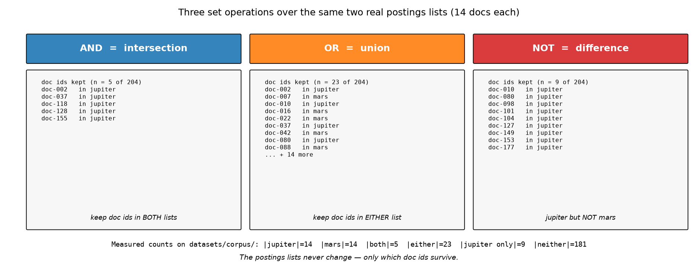
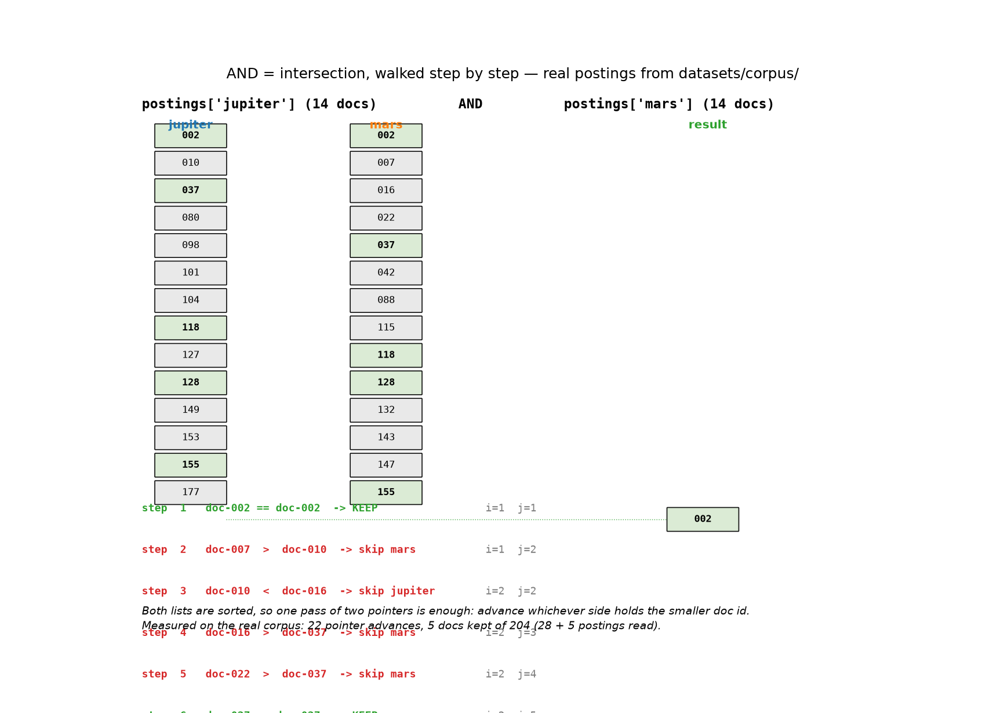
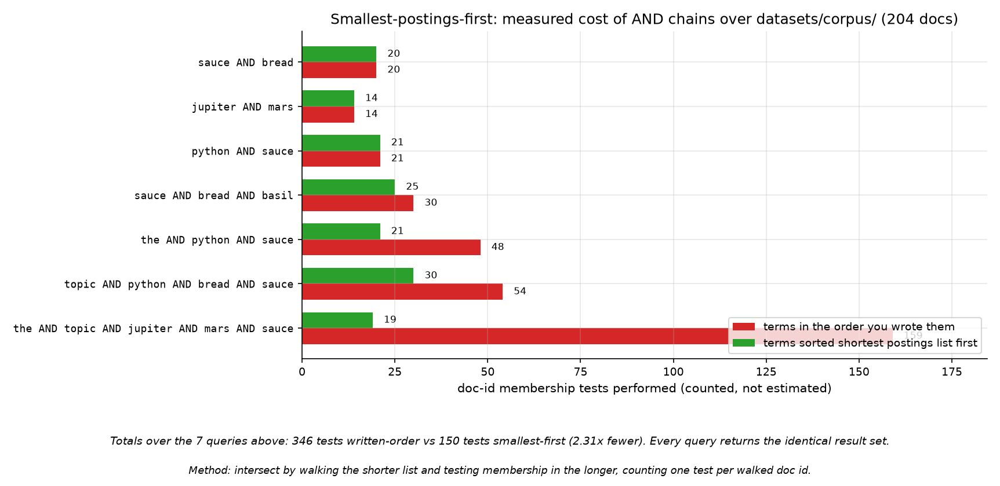
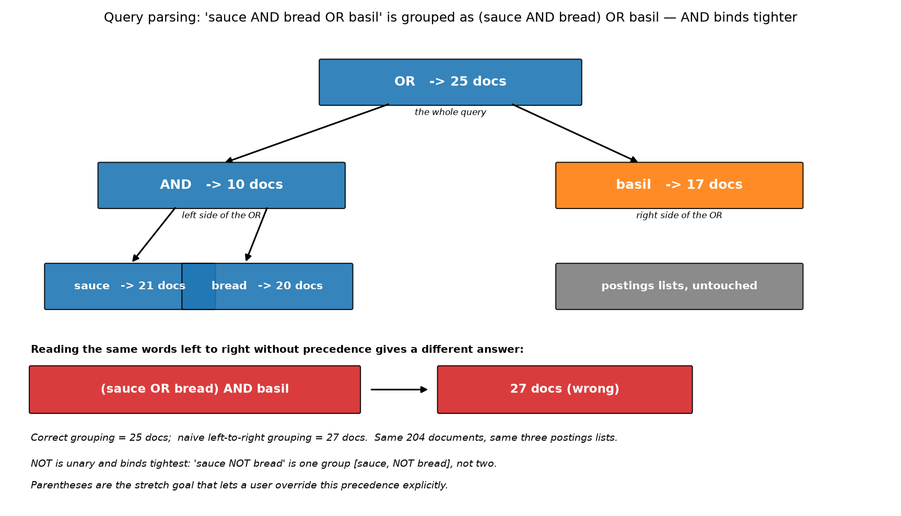

# Session 06 — Boolean Retrieval
> AND, OR, NOT are not keywords — they are set operations on postings lists, and today you build the engine that answers them.

## What you'll learn
- How AND, OR, and NOT map directly onto set intersection, union, and difference
- Why a Boolean query never touches the documents themselves — only the index
- The smallest-postings-first optimization that keeps intersections cheap
- How to parse a query string into tokens without regex or `eval()`
- Where Boolean retrieval falls short (no ranking) and what comes next

## Concepts

### 06.1 Boolean logic is set algebra

A Boolean query is a set expression. `AND` keeps only documents in both lists
(intersection), `OR` keeps documents in either (union), `NOT` removes documents
(difference). The postings lists from Session 5 are already sorted, so all three
operations are simple walks. Analogy: a Venn diagram — the engine just computes
the shaded region. Key terms: **intersection**, **union**, **difference**,
**set algebra**.

### 06.2 Postings lists are the only thing you touch

When you ask for `sauce AND basil`, the engine never opens a document. It looks
up `sauce` → `[doc-b, doc-d]` and `basil` → `[doc-b]`, then intersects them to
get `[doc-b]`. The documents themselves are irrelevant — the index has already
done the hard work. Analogy: a library's card catalogue — you find the call
numbers from the cards, then go to the shelves. You never read every book.
Key terms: **postings list**, **doc id**, **lookup**, **index-only**.

### 06.3 Smallest-postings-first: start with the shortest list

When intersecting two lists, walk the shorter one and probe the longer one. If
`basil` appears in 1 document and `sauce` in 2, you probe 1 time instead of 2.
The rule generalizes: sort all positive terms by postings length, intersect
shortest first, and the intermediate result stays as small as possible.
Analogy: filtering a guest list — apply the strictest criterion first so the
remaining list is tiny before you apply the next one. Key terms: **shortest
first**, **intermediate result**, **probe**, **optimization**.

### 06.4 Parsing a query string into tokens

A query string like `"sauce AND NOT bread"` is split into tokens: `['sauce',
'AND', 'NOT', 'bread']`. Operators are uppercased so `and` and `AND` work the
same. The parser then groups terms by OR, and within each group pairs every
term with a NOT flag. Precedence: NOT binds tightest, then AND, then OR.
Analogy: arithmetic — `3 + 4 * 5` means `3 + (4 * 5)` because `*` binds
tighter. Boolean operators have the same kind of precedence. Key terms:
**tokenize**, **operator**, **precedence**, **parse tree**.

### 06.5 Where Boolean falls short
Boolean retrieval answers "does this document match?" — a yes/no question. It
cannot answer "which matching document is best?" A query for `sauce OR bread`
returns `[doc-b, doc-d]` with no ordering. The shopper sees both, but which
comes first? That is a ranking problem, and it is exactly what Session 7's
TF-IDF solves. Analogy: a bouncer checking IDs (Boolean) versus a critic
ranking restaurants (TF-IDF). Key terms: **binary relevance**, **no ranking**,
**next step**.

## Worked example
Build a tiny inverted index and answer a Boolean query (run from this folder).
One new idea: `sorted(left + right)` merges two lists into one sorted list —
the basis of union.

```python
postings = {"sauce": ["doc-b", "doc-d"], "basil": ["doc-b"],
            "bread": ["doc-d"]}
all_docs = ["doc-a", "doc-b", "doc-c", "doc-d"]

def intersect(left, right):
    small, big = (left, right) if len(left) <= len(right) else (right, left)
    return [d for d in small if d in big]

def union(left, right):
    out = []
    for d in sorted(left + right):
        if d not in out:
            out.append(d)
    return out

def subtract(left, right):
    return [d for d in left if d not in right]

print("sauce AND basil:", intersect(postings["sauce"], postings["basil"]))
print("sauce OR bread:  ", union(postings["sauce"], postings["bread"]))
print("sauce NOT basil: ", subtract(postings["sauce"], postings["basil"]))
```

Actual output (pasted from a real venv run):

```
sauce AND basil: ['doc-b']
sauce OR bread:   ['doc-b', 'doc-d']
sauce NOT basil:  ['doc-d']
```

## Environment (venv)
Set up the course venv once (see **Environment setup** in the main `README.md`),
then activate it every study session; with it active, all commands are plain
`python ...`. This session needs only the Python standard library plus
`matplotlib` for the images.

## How this connects to the workshop
The workshop hands you a 4-document mini-corpus and a starter with 5 TODOs.
You will implement the three set operations, a query parser, and an evaluator
that handles AND, OR, and NOT with correct precedence. By the end you have a
working Boolean search engine that answers real queries against real postings
lists.

## Common pitfalls
- Forgetting that `NOT` is relative to the universe — `sauce NOT basil` means
  "docs with sauce that are not in basil's list", not "docs without basil".
- Walking the longer list in an intersection — always probe the longer list
  with the shorter one.
- Treating `AND` and `OR` as having equal precedence — they do not; AND binds
  tighter, so `a OR b AND c` means `a OR (b AND C)`.
- Using `eval()` on user input — it is a security hole and unnecessary; plain
  string splitting does the job.
- Returning duplicates from union — the `not in out` check is what makes it a
  set, not a multiset.

## Self-check quiz
1. What set operation does `AND` correspond to, and what Python data structure
   makes it natural?
2. Why does a Boolean query never need to open a document?
3. In `sauce AND basil OR bread`, which operation is evaluated first, and why?
4. What is the time complexity of intersecting two sorted postings lists of
   length m and n?
5. What question can Boolean retrieval NOT answer, and which session fixes that?

<details>
<summary>Answers</summary>

1. Intersection. Python's `set` type makes it natural, but sorted lists with a
   merge walk are what real engines use (and what you implement here).
2. Because the postings list already tells you which documents contain each
   term — the index has already done the work of reading every document.
3. `AND` is evaluated first because it has higher precedence than `OR`. The
   query means `(sauce AND basil) OR bread`.
4. O(m + n) — you walk each list once. The smallest-postings-first rule makes
   the constant factor smaller but does not change the complexity.
5. "Which matching document is most relevant?" Boolean returns a set with no
   ordering. Session 7's TF-IDF adds scores and produces a ranked list.
</details>

## Next
[→ Start the workshop](workshop/WORKSHOP.md) — build a Boolean engine that answers AND, OR, and NOT over real postings lists.
