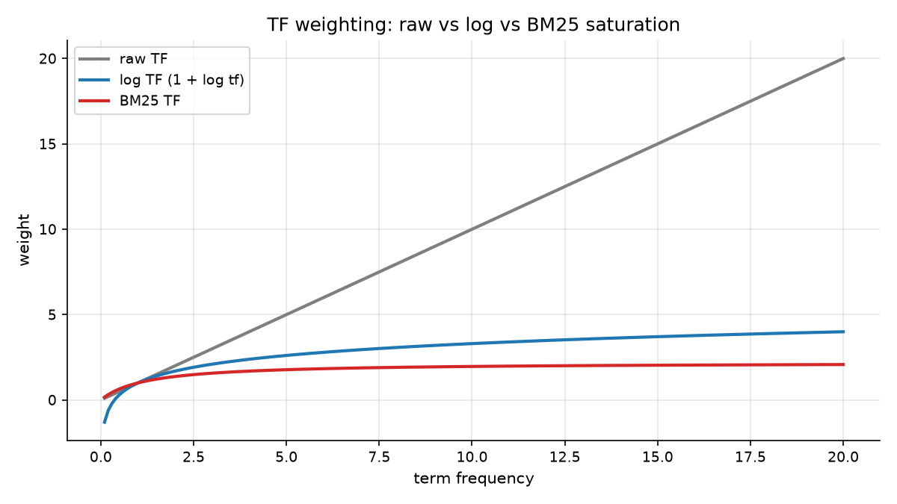
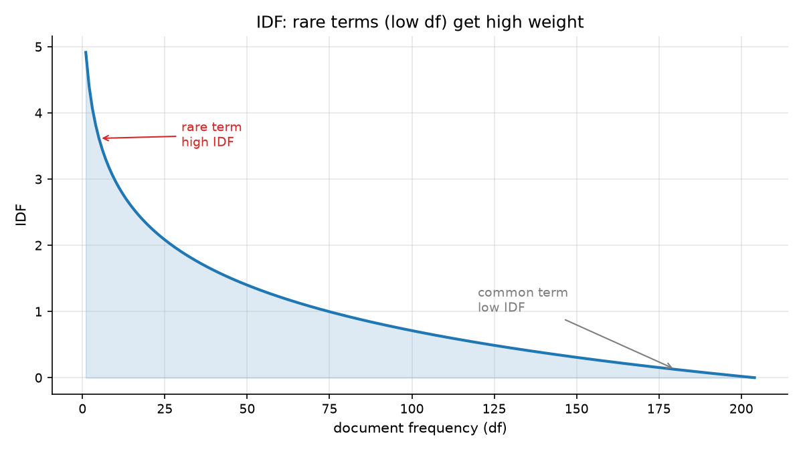
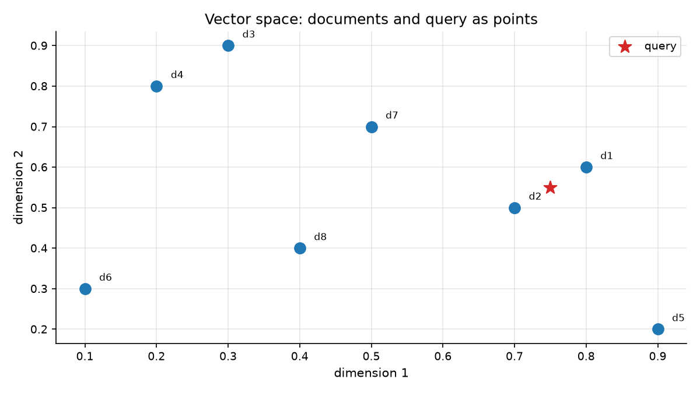
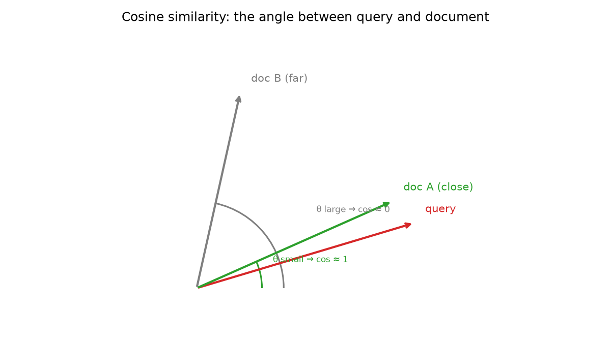

# Session 07 — TF-IDF & the Vector Space Model
> Session 6 could say *yes* or *no*. Today you teach the engine to say *how much* — and that single change is what ranking is.

## What you'll learn
- TF and IDF: why a word that appears everywhere should count for nothing
- How documents become vectors, and queries become vectors too
- Cosine similarity, and why comparing angles beats comparing raw counts
- Why length normalization is a real problem, not a nicety
- The honest difference between ranking and filtering

## Concepts

### 07.1 TF: how often a word appears

**TF** (term frequency) is simply how many times a term appears in a document.
It is the first half of the idea and, on its own, a bad one: a document that
says *sauce* 40 times beats a document that says it once, even if the second is
the better answer. Look at the raw-TF line in the picture — it is a straight
ramp upward with no ceiling. Analogy: counting how many times a student's name
appears on a page tells you how often they were mentioned, not how good their
essay was. Key terms: **term frequency**, **TF**, **raw count**.

The picture also shows the fix before we build it: `1 + log(tf)` (used in
`sklearn`'s `TfidfVectorizer`, which you use in Session 15) and BM25's
`tf(k1+1)/(tf+k1)` both bend the ramp so the twentieth *sauce* adds almost
nothing. Session 8 makes BM25 the default.

### 07.2 IDF: the word that appears everywhere means nothing

**IDF** (inverse document frequency) is the correction. A term in every
document in the corpus — `the`, `and`, `search` — cannot possibly help you
find anything, because it is true of everything. The formula is:

```
idf(term) = log( 1 + (N - df + 0.5) / (df + 0.5) )
```

where `N` is the number of documents and `df` is how many contain the term.
At `df = N` the ratio approaches zero and the weight collapses; at `df = 1` the
log is large. Analogy: in a 200-page phone book, the surname *Smith* identifies
somebody, but the word *phone* identifies nobody. Key terms: **IDF**,
**document frequency**, **inverse document frequency**, **rare**.

The chart is measured against our own 204-document corpus, so the curve you see
is the one this dataset actually produces, not an illustration.

### 07.3 Documents and queries are both vectors

Multiply TF by IDF per term and every document becomes a vector — a point in a
very high-dimensional space with one axis per vocabulary term. A query becomes a
vector the same way, using IDF weights. Retrieval is now geometry: *which points
lie near the query point?* Analogy: describe a dish by a vector of flavours
(sweet, salty, sour) and you can compare recipes by plotting them. Key terms:
**vector**, **document vector**, **query vector**, **vocabulary**.

That picture is a 2D cartoon — real documents here have 384+ dimensions — but
the geometry is identical. Every dimension after the first few is mostly zeros,
which is exactly why Session 13's ANN indexes exist.

### 07.4 Cosine similarity compares direction, not size

Two documents with identical term counts can differ wildly in length: one is 20
words, the other 2,000. Comparing raw TF-IDF sums would always crown the long
one. **Cosine similarity** ignores magnitude and compares only direction:

```
cos(q, d) = (q · d) / (|q| * |d|)
```

The result is always between 0 and 1 (or −1 for opposite directions), and it is
naturally scale-free. Analogy: two arrows pointing the same way are *parallel*
no matter how long either arrow is. Key terms: **cosine similarity**, **angle**,
**magnitude**, **norm**.

### 07.5 Ranking is not filtering — and that matters
Session 6's `python AND search` returned only documents containing **both**
words. TF-IDF does something different and better: every document gets a score,
including partial matches. Search a corpus for `cat dog` where only one document
contains both and you will still get the docs containing one, ranked lower.

This is a feature, not a bug, and it is the whole point of moving from Boolean
retrieval to a ranking model. Users misspell, use synonyms, and phrase things
loosely; a system that returns *something* plausible beats a system that returns
an empty page. The test suite pins this behavior down deliberately, because it
is the single most common surprise when moving from Session 6 to Session 7.

## Worked example
Score two documents against one query by hand (run from this folder). One new
idea: `np.zeros(5)` makes a vector of five zeros — the vocabulary size.

```python
import math
import numpy as np

# Two documents, two terms each (tf, idf already computed)
doc_a = np.array([1.0, 0.5])   # 'cat' once, 'dog' once
doc_b = np.array([2.0, 0.1])   # 'cat' twice, 'dog' rare
query = np.array([1.0, 0.3])

def cosine(a, b):
    return float(np.dot(a, b) / (np.linalg.norm(a) * np.linalg.norm(b)))

print("cos(q, A) =", round(cosine(query, doc_a), 4))
print("cos(q, B) =", round(cosine(query, doc_b), 4))
winner = "A" if cosine(query, doc_a) > cosine(query, doc_b) else "B"
print("winner:", winner)
```

Actual output (pasted from a real venv run):

```
cos(q, A) = 0.9693
cos(q, B) = 0.9060
winner: A
```

`B` mentions *cat* twice, but it is a long document diluted across other terms,
so its *direction* points less at the query than `A` does. That is the
length-normalization intuition in one number.

## Environment (venv)
Set up the course venv once (see **Environment setup** in the main `README.md`),
then activate it every study session; with it active, all commands are plain
`python ...`. This session needs `numpy` and `matplotlib` — no pandas yet.

## How this connects to the workshop
The workshop hands you a three-document mini-corpus small enough to verify with
pen and paper, and a starter with four TODOs. You will build the TF-IDF matrix,
the cosine function, and the ranking loop, then point the finished ranker at the
real 204-document course corpus. Stop 3 deliberately shows you a case where TF-IDF
returns *more* than Boolean did, and asks you to explain why that is correct.

## Common pitfalls
- Forgetting to skip zero-idf terms — a term in every document still gets a nonzero matrix cell unless you guard it.
- Comparing raw sums instead of cosines, so the longest document always wins.
- Using `log(tf)` with `tf = 0` on a query term absent from the document — that is `log(0)`, and it is a `ValueError`. Guard it.
- Expecting Boolean semantics from a ranking model (Session 6's AND behavior) and calling the difference a bug.
- Lowercasing inconsistently between index time and query time, so a query for `Cat` silently returns nothing.

## Self-check quiz
1. A term appears in 200 of 204 documents. What does its IDF tell you, and should it influence your ranking?
2. Why does a 2,000-word document with 5 query terms often beat a 100-word document with 5 query terms if you compare raw TF-IDF sums?
3. What does `cos = 0` mean, and what does `cos = 1` mean?
4. Your query is `cat dog`. Document X contains both; document Y contains only `cat`. Does Y appear in TF-IDF results? In Session 6's Boolean AND results?
5. What does the `+1` inside `log(1 + ...)` in the IDF formula protect against?

<details>
<summary>Answers</summary>

1. Its IDF is very close to zero, so it barely affects the ranking — correctly, since it tells you nothing that distinguishes documents.
2. Because its vector has a much larger norm. Cosine similarity divides by the norm, removing that length bias; comparing raw sums does not.
3. `cos = 0` means the vectors are perpendicular — no shared direction, so no overlap in meaning. `cos = 1` means they point the same way, a perfect match.
4. Yes, in TF-IDF (with a lower score). No, in Session 6's Boolean AND — AND filters to documents containing every term.
5. It keeps the argument inside the log strictly positive. Without it, when `df = N` the ratio is 0 and you get `log(0)`, which is undefined.
</details>

## Next
[→ Start the workshop](workshop/WORKSHOP.md) — build the matrix, the cosine, and the ranking loop by hand.
