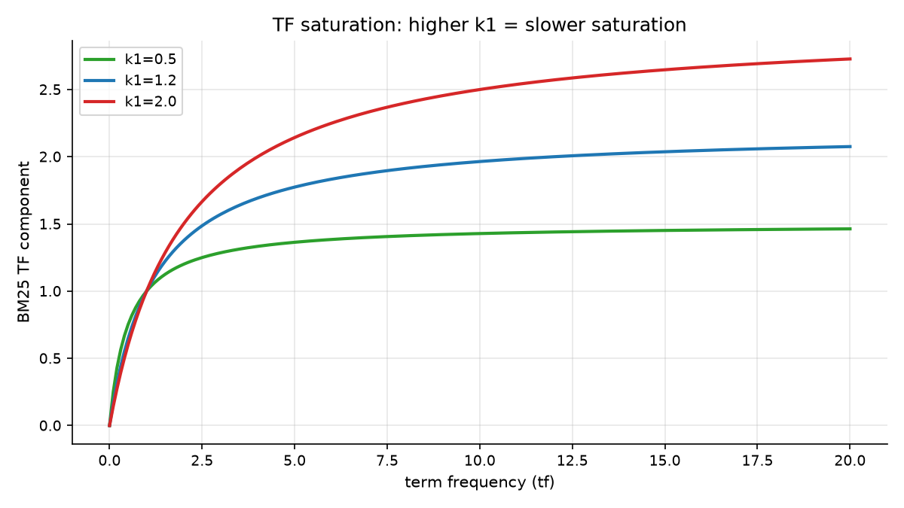
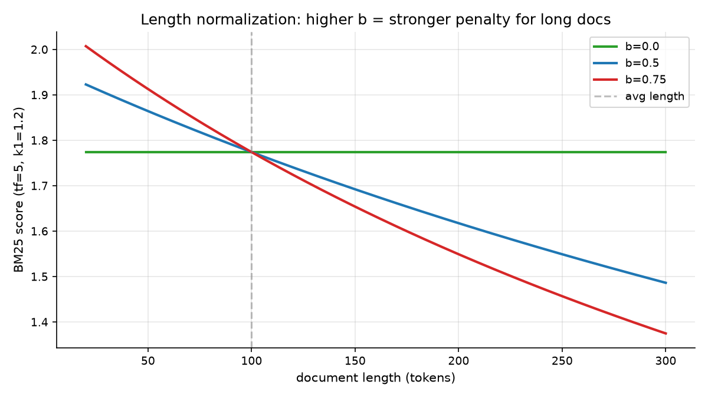
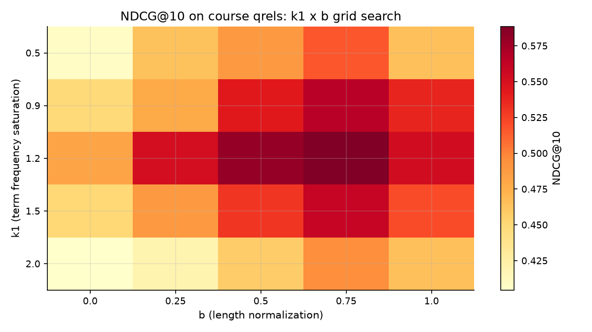

# Session 08 — BM25
> TF-IDF was a good idea with two rough edges. BM25 fixes both — and gives you two knobs you can actually tune.

## What you'll learn
- The BM25 formula, one component at a time, with no algebra left unexplained
- `k1`: why the tenth occurrence of a term matters far less than the first
- `b`: why a 2,000-word document should not beat a 200-word one automatically
- How to hand-compute a BM25 score and check the code against your arithmetic
- How to grid-search `k1` and `b` against the course qrels

## Concepts

### 08.1 The formula, taken apart
BM25 is a **probabilistic ranking function** (Robertson & Zaragoza, 2009) —
the descendant of the ranking systems of the 1970s, and still the default inside
Elasticsearch, OpenSearch, and Lucene today. The whole formula is:

```
score(q, d) = Σ  IDF(t) · (tf · (k1 + 1)) / (tf + k1 · (1 − b + b · dl/avgdl))
              t∈q
```

Four pieces, each doing one job:

| piece | job |
|---|---|
| `IDF(t)` | rare terms matter more (Session 7) |
| `tf·(k1+1)/(tf+k1)` | term frequency **saturates** |
| `dl / avgdl` | how long is this doc vs the average |
| `k1`, `b` | the two knobs you tune |

Everything else is bookkeeping. Analogy: it is a recipe where each ingredient
has one job — the salt brings out flavour (IDF), the heat is turned down once
the pot is hot (saturation), and you adjust the burner to suit your stove
(length normalization). Key terms: **BM25**, **saturation**, **length
normalization**, **k1**, **b**.

### 08.2 k1: term frequency stops mattering eventually

Raw TF counts occurrences forever. But the tenth time a document says *sauce*
tells you almost nothing new. `tf(k1+1)/(tf+k1)` rises steeply at first and
then flattens toward `k1 + 1`. The picture shows three curves: `k1 = 0.5` turns
into a wall almost immediately (the second occurrence is worth nearly as much
as the first), while `k1 = 2.0` keeps rewarding repetition much longer.
Analogy: the first compliment matters; the fifteenth is noise. Key terms:
**k1**, **saturation**, **damping**, **diminishing returns**.

The default is `k1 = 1.2`, which is what you almost always want. Tune it only
with data — the workshop's grid search is the honest way to see whether yours
prefers something else.

### 08.3 b: the length penalty, and what b = 0 really means

A document with the right words ten times outranks one that mentions them once
— but only partly because it has more words to do it with. The factor
`(1 − b + b · dl/avgdl)` divides that advantage back out:

- **`b = 0`** — no length normalization at all. A 50,000-word page that says
  *sauce* once outranks a 150-word page that says it twice.
- **`b = 0.75`** (the default) — partial correction. Length helps, but cannot
  buy relevance on its own.
- **`b = 1`** — full correction. Length is completely neutralized.

Analogy: judging an essay by word count (b = 0) versus judging it by how
proportionally much of it addresses the question (b = 1). Key terms: **b**,
**dl**, **avgdl**, **normalization**.

This is a real, observable effect in the workshop data, and the test suite pins
it down: two documents with identical term counts but different lengths really
do score differently at `b = 0.75` — and *identically* at `b = 0`.

### 08.4 Two knobs beat one guess

`k1` and `b` are the parameters you tune per corpus. The picture is a grid
search: every combination of `k1` × `b`, scored against the judgments. Real
engines default to 1.2/0.75 because that generalizes well across collections,
but a corpus of short product descriptions may want a different `b` than a
corpus of long articles. Analogy: a recipe that says "salt to taste" — the
defaults are a starting point, not a law. Key terms: **grid search**, **tuning**,
**parameter**, **default**.

### 08.5 What BM25 fixed, and what it did not
Compared with Session 7's TF-IDF: BM25 replaces `log(tf)` with a saturating
curve (better behaviour on repeated terms), and replaces `cosine` with an
explicit length penalty (clearer to tune). What it did **not** fix is the
problem Session 4 measured: a shopper who types `soccer` finds nothing, because
the corpus says `football`. BM25 is still a *lexical* model — it matches words,
not meanings.

That limitation is the entire reason for Sessions 12-22, and knowing exactly
what BM25 cannot do is what makes hybrid search worth building. Key terms:
**lexical**, **saturation**, **tunable**, **limitation**.

## Worked example
Hand-compute one BM25 score and check the code against your arithmetic (run
from this folder). Note the corpus first — `sauce` appears in **both** sentences
of doc-a, so `tf = 2`, a detail students routinely get wrong.

```python
import math
import sys
sys.path.insert(0, "workshop/solution")
from bm25 import build_stats, bm25_score

stats = build_stats("workshop/data")
print("doc lengths:", stats["doc_len"], "avgdl:", stats["avgdl"])
print("tf of 'sauce' in doc-a:", stats["tf"]["doc-a"]["sauce"])

# by hand, with N=3, df(sauce)=2, dl=14, avgdl=15, k1=1.2, b=0.75
idf = math.log(1 + (3 - 2 + 0.5) / (2 + 0.5))
norm = 1.2 * (1 - 0.75 + 0.75 * 14 / 15)
print("by hand:", round(idf * (2 * 2.2) / (2 + norm), 6))
print("by code:", round(bm25_score("sauce", "doc-a", stats), 6))
```

Actual output (pasted from a real venv run):

```
doc lengths: {'doc-a': 14, 'doc-b': 13, 'doc-c': 18} avgdl: 15.0
tf of 'sauce' in doc-a: 2
by hand: 0.658604
by code: 0.658604
```

Your arithmetic and the code agree to six decimal places. That is the point of
hand-computing: when a test fails at 2am you now know whether the formula or
your reading of the data is at fault.

## Environment (venv)
Set up the course venv once (see **Environment setup** in the main `README.md`),
then activate it every study session; with it active, all commands are plain
`python ...`. This session needs only the Python standard library plus
`matplotlib` for the images — no numpy even.

## How this connects to the workshop
The workshop gives you a three-document corpus you can read in full, so the
BM25 score is computable by hand. You will implement IDF, the corpus statistics,
the scoring function, and the ranking loop — then grid-search `k1` and `b` and
see the surface you are choosing from. Session 10 replaces this eyeballing with
a real metric.

## Common pitfalls
- Counting `tf` as 1 because the word "appears" rather than counting every occurrence — it changes the score.
- Computing `df` by counting occurrences instead of documents, which inflates IDF and over-ranks rare-ish terms.
- Dividing by zero when `avgdl` is 0 (an empty corpus) — guard it.
- Setting `b = 1` by default: it removes length information entirely, and real users do care about concise pages.
- Believing BM25 understands meaning. It matches words. Session 12 is the fix.

## Self-check quiz
1. In the BM25 formula, what job does `k1` do, and what happens to the score as `tf` grows large?
2. With `b = 0`, what property of a document stops it from earning a higher score?
3. Your corpus has documents averaging 500 words. A 5,000-word document contains your query term 4 times; a 400-word document contains it 3 times. With `b = 0.75`, which wins?
4. Why is the default `k1 = 1.2` rather than a value derived from first principles?
5. A shopper types `soccer`; the corpus only ever contains `football`. What does BM25 return, and which session fixes it?

<details>
<summary>Answers</summary>

1. `k1` controls how fast the TF component saturates. As `tf → ∞` the factor `tf(k1+1)/(tf+k1)` approaches `k1 + 1`, so repeated occurrences add rapidly diminishing amounts.
2. Nothing. With `b = 0` the normalization factor is constant, so extra length cannot help a document score higher.
3. It depends on IDF too, but the length penalty is what is being asked: at `b = 0.75` the 5,000-word doc's normalization is `1.2 × (0.25 + 0.75 × 10)` = 9.9 versus the 400-word doc's `1.2 × (0.25 + 0.75 × 0.8)` = 1.02, so the short document's TF term is far less throttled. The 400-word document wins.
4. It is an empirical default that works well across many collections. There is no principled derivation; tuning it against real judgments is the only honest way to choose, which is what the grid search is for.
5. An empty result set — `soccer` is not a term in the index, so `tf = 0` and the term contributes nothing. Session 12's embeddings fix this.
</details>

## Next
[→ Start the workshop](workshop/WORKSHOP.md) — implement BM25, verify it against your own arithmetic, and tune the knobs.
