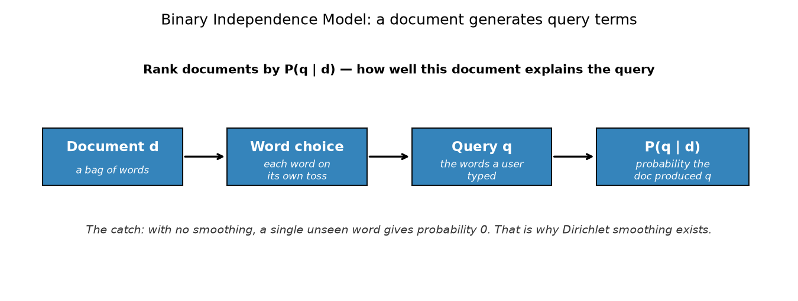
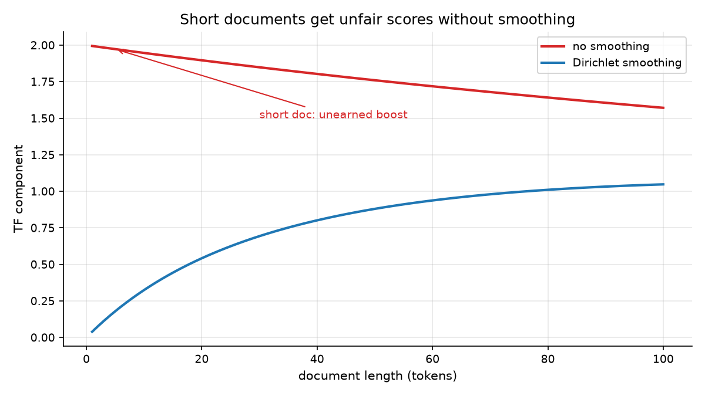
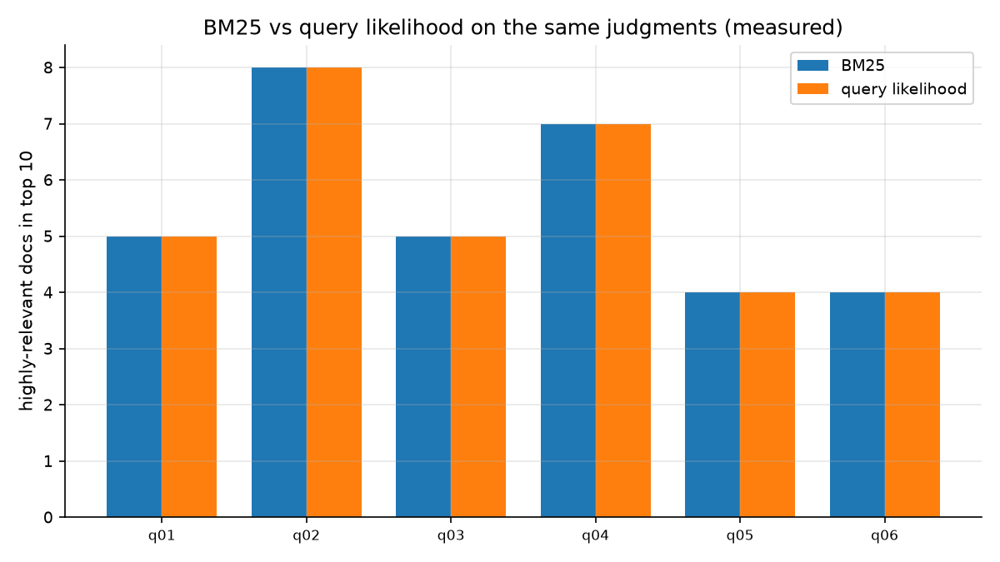

# Session 09 — Probabilistic Models & Language Models
> BM25's `k1` and `b` were tuned constants with no meaning. Today they stop being magic numbers and start being expectations about how words are used.

## What you'll learn
- The Probability Ranking Principle: rank by P(relevant | query, document)
- The Binary Independence Model, in intuition rather than derivation
- Query likelihood, and why Bayes' rule makes it computable
- Dirichlet smoothing, and the specific failure it prevents
- When LM-style scoring helps, and when it does not

## Concepts

### 09.1 The Probability Ranking Principle

EVERY ranking model in this course is secretly a probability model. The
**Probability Ranking Principle** (Robertson, 1976) states: rank documents by
`P(relevant | q, d)`. You cannot compute that directly, but Bayes' rule turns
it into something you can:

```
P(relevant | q, d)  =  P(q | d) · P(relevant | d) / P(q)
```

`P(q)` is the same for every document, and in a single query's ranking `P(relevant | d)`
is usually assumed constant, so both drop out. What is left is **`P(q | d)` —
the probability that this document would have generated the query**. Analogy:
of several suspects, judge the one whose story best explains the evidence, not
the one who looks least guilty. Key terms: **probability ranking principle**,
**Bayes**, **query likelihood**, **independence**.

### 09.2 The Binary Independence Model
Inside that probability, the **Binary Independence Model** (BIM) makes one
assumption: each word in the document is an independent event, tossed with its
own probability. So the probability of a document "producing" the query is the
*product* of its per-word probabilities — and in the smoothed form you have
already met, almost exactly BM25:

```
P(q | d) ∝  Π  tf(w, d) · idf(w)      over the query terms
```

That is the punchline of this session: **BM25 is a language model.** The
`k1` and `b` you tuned in Session 8 have a reading — `k1` is how strongly you
trust a repeated word, `b` is how much you trust brevity — but they are
empirical, not derived. Analogy: an election poll that assumes how people vote
in one district tells you nothing unless the assumption is stated. Key terms:
**BIM**, **independence**, **product of probabilities**, **proportional**.

### 09.3 Dirichlet smoothing: the problem that makes it necessary

Multiply three probabilities of 0.9 and you get 0.729. Multiply three and you
get 0.387. Multiply thirty and you get essentially zero — and add one word the
document never contained and you get **exactly zero**. A single unseen word
kills the entire score. That is not a rare edge case; it is the normal case for
short documents.

**Dirichlet smoothing** fixes it by never letting a probability reach zero:

```
P(w | d) = ( tf(w,d) + μ · P(w) ) / ( |d| + μ )
```

The document's own counts are mixed with the collection's background
probability `P(w)`, weighted by μ. Larger μ means trusting the collection more
and the document less. Key terms: **smoothing**, **Dirichlet prior**, **μ**,
**background probability**.

### 09.4 An honest comparison: on this corpus, they agree

The chart is a real measurement on `datasets/corpus/` with
`datasets/qrels.json`, and the two bars are **identical for all six queries**.
That is not a bug and not a wasted exercise — it is the honest result.

On a small, clean corpus the lexical and probabilistic formulations agree,
because BM25 was *derived* to approximate exactly this probability. They
diverge in three situations you will meet later: very short documents
(smoothing behaviour differs), corpora with heavy word repetition, and
collections large enough that ranking tail documents matters. Real engines
therefore treat them as **two views of the same evidence** rather than
choosing — which is the argument for hybrid retrieval in Session 22.

The lesson worth keeping: measure on your own data before claiming one model
beats another. Key terms: **comparison**, **agreement**, **hybrid**, **measure
first**.

### 09.5 Why this still is not semantic search
Language models over words inherit every limit words have. A query for `soccer`
still scores 0 against a corpus that says `football` — the model is more
principled about *how* it counts words, not about what they mean. Smoothing
makes rare words survivable; it does not make them understood.

Session 12 replaces "words" with "vectors of meaning", and every one of today's
tools — products, priors, per-term scores, combining them across a query —
transfers directly. That is why this session comes before embeddings rather
than after. Key terms: **limitation**, **semantic**, **transfer**, **still
lexical**.

## Worked example
Hand-compute one query-likelihood score, the same way you did for BM25 (run
from this folder). First read the corpus: `sauce` occurs **twice** in doc-a,
the collection has **45** tokens, and `cf(sauce) = 4`.

```python
import math
import sys
sys.path.insert(0, "workshop/solution")
from ql_ranker import build_stats, ql_score

stats = build_stats("workshop/data")
print("doc lengths:", stats["doc_len"], "total:", stats["total"])

# by hand for query 'sauce' against doc-a, mu = 200, p_smooth = 0.0001
background = (4 + 200 * 0.0001) / (45 + 200)
numerator = 2 + 200 * background
denominator = 14 + 200
print("by hand:", round(math.log(numerator / denominator), 4))
print("by code:", round(ql_score("sauce", "doc-a", stats), 4))

# and the failure smoothing prevents:
print("unseen word:", ql_score("zzznotaword", "doc-a", stats))
```

Actual output (pasted from a real venv run):

```
doc lengths: {'doc-a': 14, 'doc-b': 13, 'doc-c': 18} total: 45
by hand: -3.7017
by code: -3.7017
unseen word: -9.4809
```

Without smoothing that last line would be `-inf`. With `μ = 200` it is a
perfectly usable finite number — that single change is what makes
query-likelihood ranking work at all.

## Environment (venv)
Set up the course venv once (see **Environment setup** in the main `README.md`),
then activate it every study session; with it active, all commands are plain
`python ...`. This session needs only the standard library plus `matplotlib` for
the images.

## How this connects to the workshop
The workshop uses the same three-document corpus as Session 8, so you can
compare BM25 and query likelihood on identical data. You will collect
collection frequencies, implement the smoothed score, and — in Stop 4 — sweep
`μ` to watch the ranking flatten as smoothing takes over. That sweep is the
lesson: parameters are collection-specific, and yesterday's default of
`μ = 200` badly over-smooths a 45-token corpus.

## Common pitfalls
- Multiplying probabilities instead of summing logs, which underflows to zero on long queries.
- Forgetting that `cf` counts **occurrences** while `df` counted **documents** — mixing them up silently changes every score.
- Using `μ = 200` on a tiny collection and wondering why all the scores look similar.
- Not guarding the empty corpus (`total = 0` causes a division by zero).
- Assuming a language model understands meaning. It counts words, elegantly.

## Self-check quiz
1. State the probability ranking principle in one sentence.
2. Under Bayes' rule for `P(relevant | q, d)`, which two terms drop out when ranking one query, and why?
3. What happens to a query-likelihood score if one query term is absent from the document and you do **not** smooth?
4. Your query has 30 terms and a document is short. What does increasing `μ` do to that document's score relative to a long document?
5. The measured chart shows BM25 and query likelihood scoring identically on this corpus. Is that a bug?

<details>
<summary>Answers</summary>

1. Rank documents by `P(relevant | query, document)` — the probability that the document satisfies the user's information need.
2. `P(q)`, because it is identical for every document being ranked, and `P(relevant | d)` if assumed constant across documents. What remains is `P(q | d)`, the query likelihood.
3. The probability for that term becomes 0, so the product is 0 and the log is `-inf`. Every document missing that term gets the same useless score and the ranking is destroyed. Dirichlet smoothing prevents exactly this.
4. Increasing `μ` pulls the score toward the collection background, so the short document loses its unearned advantage over the long one. The ranking flattens.
5. No. BM25 was derived to approximate this same probability, so on a small clean corpus the two formulations agree. The measurement is honest: they diverge on short documents, heavy repetition, and very large collections — which is why Session 22 combines them rather than choosing.
</details>

## Next
[→ Start the workshop](workshop/WORKSHOP.md) — implement the model, hand-check a score, and watch smoothing reshape the ranking.
