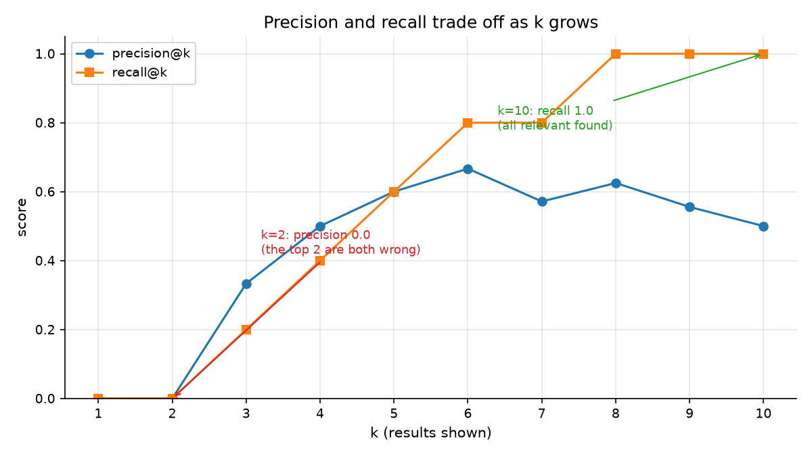
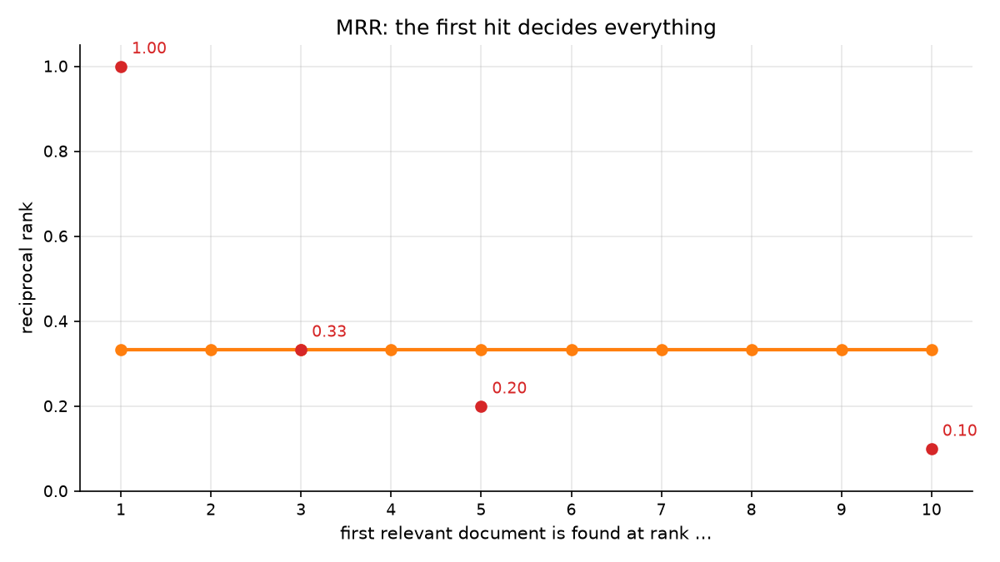
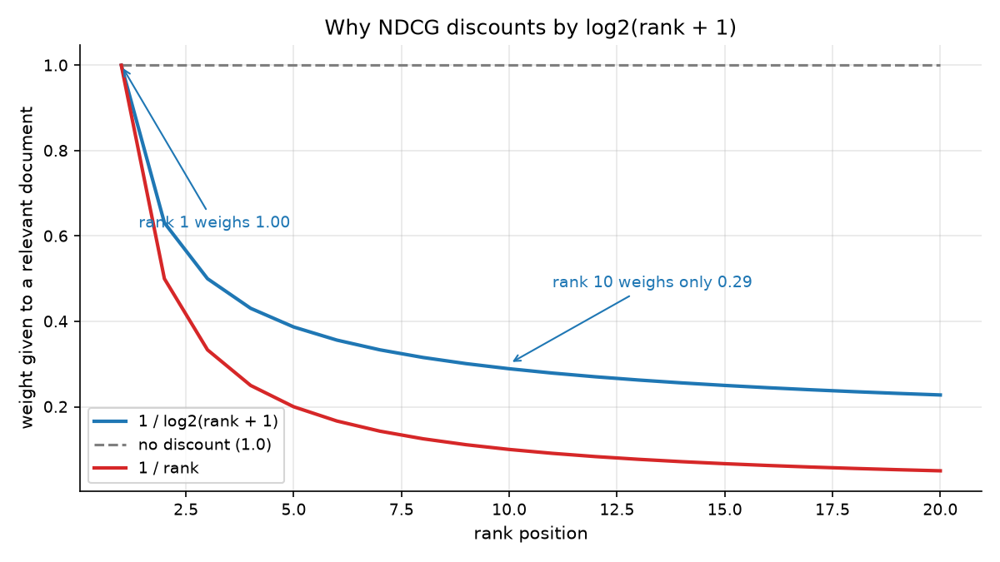
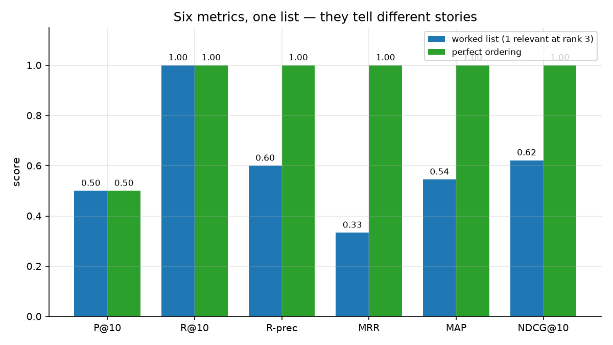

# Session 10 — Evaluation
> Everything so far has been opinion dressed as mathematics. Today you build the measuring stick — and discover that a perfect score can be the most suspicious result in the room.

## What you'll learn
- Precision, recall, and why reporting one without the other is misleading
- R-precision, the metric that needs no `k` at all
- MRR, MAP, and how each models a different user
- NDCG with graded relevance, and what the log discount is actually for
- How to read a results table — including when every number is 1.0 and that is bad news

## Concepts

### 10.1 Precision and recall pull in opposite directions

**Precision@k** asks: of the `k` things you showed me, how many did I want?
**Recall@k** asks: of everything I wanted, how much did you find? The picture
plots both on the worked example, and the crossing is the whole story: at
`k = 2` precision is **0.0** (both top results are wrong) while recall is still
0; by `k = 8` recall is **1.0** — everything relevant has been found — but
precision has fallen to 0.625.

Analogy: fishing. Precision is the fraction of your catch you actually wanted;
recall is the fraction of the fish in the lake you caught. A net with a tiny
mesh has perfect recall and useless precision. Key terms: **precision**,
**recall**, **k**, **trade-off**.

Never report precision alone — `k = 1` always gives you 0.0 or 1.0, and
`k = 10000` always gives you ~1.0. **F1**, their harmonic mean, punishes being
lopsided: it is only high when both are high.

### 10.2 R-precision: the metric with no knob
**R** is the number of relevant documents. Cut the ranked list at exactly `R`
items — the point where an ideal user would have run out — and report the
precision of that cut. No `k` to choose, nothing to tune.

On the worked list, `R = 5` and the top five are `d4, d2, d1, d9, d7`, of which
three are relevant, so R-precision = **0.6**. Compare that with the perfect
ordering, which scores **1.0**. One number, no parameter. Analogy: "of the
first five albums I played, how many did I keep?" Key terms: **R-precision**,
**cut-off**, **parameter-free**.

### 10.3 MRR, MAP, and the users they model

Different metrics encode different assumptions about the user, and picking the
wrong one quietly optimizes the wrong thing.

**MRR** (mean reciprocal rank) models a user who wants *one* good answer and
clicks the first useful result. `1 / position` of the first hit: rank 1 scores
1.0, rank 3 scores 0.33, rank 10 scores 0.10. Everything after the first hit is
invisible to it.

**MAP** (mean average precision) rewards putting *all* relevant documents high,
by averaging the precision at each moment you got something right. A relevant
document at rank 1 counts `1/1`; the same document at rank 50 counts `1/50`.

On the worked list: MRR = **0.3333** (first hit at rank 3), MAP = **0.5450**.
The gap is the diagnosis — MRR says "the top of the list is bad", MAP says
"we do find everything, just late". Analogy: MRR asks how quickly the shop
assistant found your item; MAP asks how many of the items on your list ended up
in the right places. Key terms: **MRR**, **MAP**, **first hit**, **ranking
quality**.

### 10.4 NDCG: graded relevance and a position discount

The course judgments are **graded** (0, 1, 2), and two of them scoring 2 should
beat two scoring 1. NDCG handles this with two devices:

- **Gain** `2^rel − 1` — a grade-2 document contributes 3, not 2.
- **Discount** `1 / log2(rank + 1)` — rank 1 weighs **1.00**, rank 10 weighs
  **0.29**. The log curve falls steeply early and flattens late, which matches
  how users actually behave: swapping results 1 and 2 is a disaster, swapping
  results 20 and 21 is nothing.

Dividing by the ideal DCG normalizes it, so queries with different numbers of
relevant documents become comparable — which is what lets you average them.
Analogy: a restaurant guide where a 5-star review outranks a 4-star one, and
being on page 1 matters far more than being on page 4. Key terms: **NDCG**,
**DCG**, **gain**, **discount**, **graded relevance**.

### 10.5 The lesson: a perfect score may mean a broken test

The chart scores the worked list against a perfect ordering. Watch which
metrics can tell the difference at all:

| metric | worked list | perfect |
|---|---|---|
| P@10 | 0.500 | 0.500 |
| R@10 | 1.000 | 1.000 |
| R-precision | 0.600 | 1.000 |
| MRR | 0.333 | 1.000 |
| MAP | 0.545 | 1.000 |
| NDCG@10 | 0.622 | 1.000 |

P@10 and R@10 are **identical** — the set of ten returned documents is the same
either way; only the order differs. Since these judgments are ungraded, no
order-sensitive metric can see the difference. Choosing metrics is choosing
what you are allowed to see.

Now run the real comparison on `datasets/corpus/` with `datasets/qrels.json`,
scoring TF-IDF, BM25 and query likelihood through this one implementation. All
three score **NDCG@10 = 1.0000**. That is not because the rankers are
exceptional. It is because those judgments were *generated* as "contains at
least two query terms" — which is precisely what a lexical ranker maximizes. A
test built from the same signal as the thing it tests cannot fail. The chart
below shows the second half of the problem: **every query has 34 relevant
documents and the list holds 10**, so recall is capped at `10/34 = 0.2941`
regardless of quality.

Analogy: grading an essay with an answer key the student wrote. Key terms:
**circular evaluation**, **ceiling**, **judgments**, **sanity check**.

This is why real judgments come from humans reading documents, and why
Sessions 16, 22 and 23 reuse this `metrics.py` but bring their own relevance
data.

## Worked example
Score one ranked list by hand, then check the code (run from this folder).

```python
import sys
sys.path.insert(0, "workshop/solution")
from metrics import (JUDGED, RANKED, RELEVANT, average_precision,
                     ndcg_at_k, precision_at_k, reciprocal_rank)

rel = set(RELEVANT)
print("R =", len(rel))
print("first hit at position:",
      next(i for i, d in enumerate(RANKED, start=1) if d in rel))
print("P@10 =", precision_at_k(RANKED, RELEVANT, 10))
print("MRR  =", round(reciprocal_rank(RANKED, RELEVANT), 4))
# AP by hand: hits land at 3, 4, 5, 6, 8
hits = [(3, 1), (4, 2), (5, 3), (6, 4), (8, 5)]
ap = sum(h / p for p, h in hits) / len(RELEVANT)
print("AP by hand =", round(ap, 4))
print("AP by code =", round(average_precision(RANKED, RELEVANT), 4))
print("NDCG@10 =", round(ndcg_at_k(RANKED, JUDGED, 10), 4))
```

Actual output (pasted from a real venv run):

```
R = 5
first hit at position: 3
P@10 = 0.5
MRR  = 0.3333
AP by hand = 0.545
AP by code = 0.545
NDCG@10 = 0.6215
```

Your arithmetic and the code agree exactly. Note `P@10 = 0.5` on a list that
finds everything relevant — a reminder that P@10 is measuring something
different from what you may have assumed.

## Environment (venv)
Set up the course venv once (see **Environment setup** in the main
`README.md`), then activate it every study session; with it active, all
commands are plain `python ...`. This session needs **only the Python standard
library** — `metrics.py` deliberately imports nothing, which is why you can copy
it into Sessions 16, 22 and 23 without dragging dependencies along.

## How this connects to the workshop
The workshop implements five metrics from scratch against a 10-document example
you can verify by hand, then runs the real comparison that produced the tables
above. The final stop is the important one: you will see all three rankers score
perfectly and work out why that is a warning rather than a triumph.

## Common pitfalls
- Reporting precision without recall — at `k = 1` it is always 0.0 or 1.0 and says nothing.
- Averaging metrics over queries that have no relevant documents; the code skips them, and so should you.
- Forgetting that `k` truncates from the *top*: `RANKED[:k]` is right, `RANKED[-k:]` is nonsense.
- Using `log2(rank + 1)` when you meant `log(rank)`; the +1 prevents `log(0)`.
- Treating a perfect score as success. Ask what generated the judgments first.

## Self-check quiz
1. Your engine returns `k = 5` results, 2 relevant. Another returns `k = 50`, 20 relevant, out of 20 total. Which is better, and why is the question unanswerable?
2. A user wants one recipe and clicks the first result. Which metric, and what does it ignore?
3. In NDCG, what happens to a relevant document's contribution between rank 1 and rank 10, and why is a log used rather than a straight `1/rank`?
4. Why does dividing by the ideal DCG make NDCG comparable across queries?
5. Every ranker scores NDCG@10 = 1.0 on your test collection. Give two possible explanations and how to tell them apart.

<details>
<summary>Answers</summary>

1. Unanswerable without `k` and the total relevant count. The first has precision 0.4, recall 0.1; the second precision 0.4, recall 1.0. They are trading off along the same curve — you need to know what the user wants.
2. MRR. It models "click the first useful thing" and completely ignores everything after the first hit, so it cannot see whether the rest of the list is good.
3. It falls from a weight of 1.00 to 0.29. The log curve drops steeply at small ranks and flattens later, matching the fact that users notice early swaps and not late ones. `1/rank` would penalize position 10 almost as hard as position 2.
4. Without it, a query with 34 relevant documents would always outscore one with 5 purely because more terms accumulate. Dividing by the best achievable score puts every query on a 0–1 scale where 1.0 means "perfectly ordered".
5. Either (a) the engine genuinely is excellent, or (b) the judgments were generated from the same signal the ranker uses, making the test circular. Tell them apart by reading the judgments: if "relevant" is defined by term overlap, you have case (b). Session 10's own qrels are exactly case (b) — and that is the point of the exercise.
</details>

## Next
[→ Start the workshop](workshop/WORKSHOP.md) — build the metrics, produce the table, and diagnose why it looks too good.
