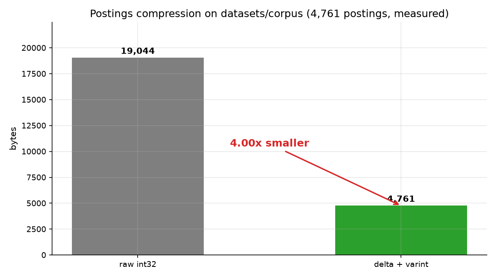
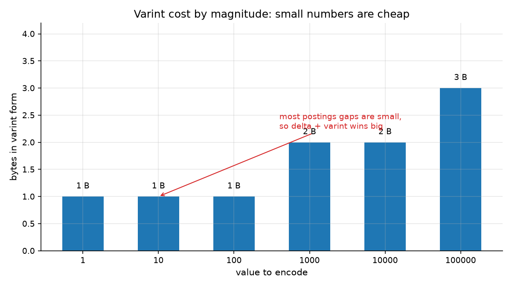
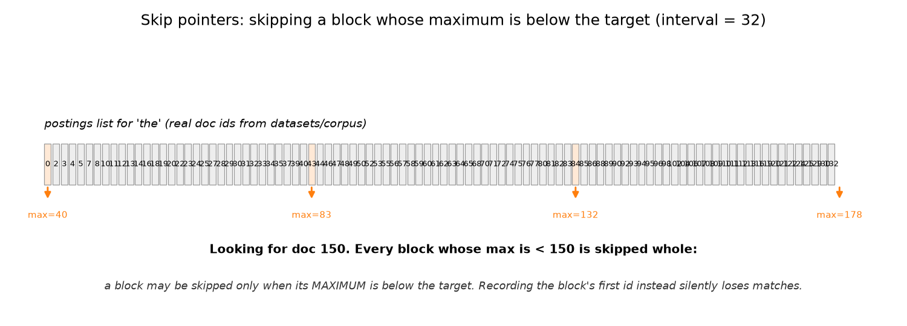
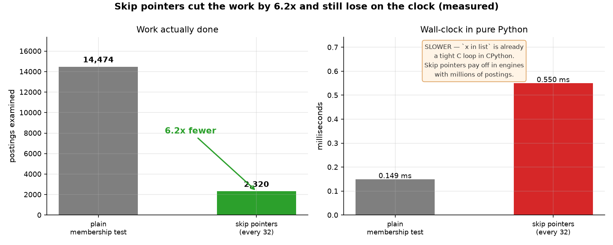

# Session 11 — Efficient Scoring
> Speed is not a faster machine, it is less work. Today you make the engine examine six times fewer documents — and find out why that can still make it slower.

## What you'll learn
- Delta encoding and varint compression, and how they get postings 4× smaller
- Skip pointers, and the one bug that makes them silently lose documents
- Early termination and what block-max WAND does with it
- DAAT versus TAAT scoring, and why real engines choose DAAT
- Why "fewer comparisons" and "faster" are two different claims

## Concepts

### 11.1 Delta encoding and varint: make the index smaller


Postings lists are sorted document ids, and sorted numbers have one property you
can exploit: the **gaps** between them are usually small. `[3, 7, 9, 40]`
becomes `[3, 4, 2, 31]` and the second list is made of much smaller numbers.

Then a **varint** (variable-length integer, LEB128) stores them in as few bytes
as the number actually needs: 7 bits of payload per byte, with the high bit set
when more bytes follow. So `100` costs 1 byte and `100000` costs 3 — the second
chart shows the curve. Put the two together and a postings list that took 4
bytes per document id becomes about 1: on the real course corpus, 19,044 bytes of
`int32` shrink to 4,761, which is **4.00× smaller**.

Analogous to a staircase handrail: store "up 2 steps, up 2 steps" instead of
"floor 1, floor 3, floor 5". Key terms: **delta encoding**, **varint**,
**compression**, **gap**.

### 11.2 Skip pointers: jump over a whole block

Intersecting two postings lists walks both in order. A **skip pointer** sits
every N entries and records where that block starts **and the largest document
id inside it**. When you are hunting for document 150, every block whose
maximum is below 150 is provably useless, so you leap over it whole.

The one thing you must get right, and the reason the test suite checks 48,841
term pairs: a block may be skipped **only when its maximum** is below the
target. Record the block's *first* id instead and you will jump over entries
that are larger than your target, and the engine will silently stop returning
documents it should have found. That failure mode has no error message.

Analogy: looking for page 300 in a book using chapter starts — you can skip
chapters that end before 300, but never ones that contain it. Key terms:
**skip pointer**, **block maximum**, **intersection**, **prune**.

### 11.3 Early termination and block-max WAND
The deepest idea here: if you only want the top 10 results, you do not need to
score every candidate. **Block-max WAND** groups each postings list into blocks
and remembers the best score in each block. Terms are visited in order of their
current block max, and the whole loop stops as soon as the largest remaining
block max cannot beat the 10th-best score you already hold.

This session treats WAND as a **demonstration only** — you will read and run the
implementation in `fast_score.py`, not write it. It requires accumulator state
and pivot selection that is a lot of machinery for a 204-document teaching
corpus. Sessions 21-23 see it again inside OpenSearch, where it is the engine's
job and not yours.

Analogy: weeding a garden — once the row in front of you is clearly all
weeds, you stop and move on; you do not inspect every blade. Key terms:
**early termination**, **WAND**, **block max**, **top-k**.

### 11.4 DAAT versus TAAT
Two ways to score a multi-term query. **TAAT** (term-at-a-time) finishes one
term's entire postings list before starting the next, so it needs an
accumulator for every document and is memory-hungry. **DAAT**
(document-at-a-time) advances all lists together, document by document, keeps
one small accumulator, and can stop the moment the answer is decided. Every
engine that cares about memory does DAAT.

The engine in this session is DAAT: `intersect_with_skips` walks both lists in
the same pass. Key terms: **DAAT**, **TAAT**, **accumulator**, **streaming**.

### 11.5 Fewer comparisons is not the same as faster

Here is the honest result of the workshop's benchmark. Skip pointers examine
**6.24× fewer** postings — 2,320 instead of 14,474 — and they are **slower**,
0.550 ms against 0.149 ms.
Both numbers are correct and both matter. The comparison count is the portable
measure: it predicts what the optimization does in a real engine. The wall-clock
number is specific to this interpreter, where `if value in list` already
compiles to a tight C loop that runs at memory speed, and where bookkeeping in
Python costs more than the comparisons it saves. On a 145-entry list that
overhead is not yet paid back.

The lesson generalizes: measure the work, then measure the clock, and never
assume the first implies the second. Key terms: **comparison count**,
**wall-clock**, **overhead**, **C-level loop**.

## Worked example
Compress a real postings list, decompress it, and confirm you got the original
back (run from this folder). One new idea: `b"".join(...)` builds one `bytes`
object out of many small ones.

```python
import sys
sys.path.insert(0, "workshop/solution")
from fast_score import (build_postings, compress_postings,
                        decompress_postings, varint_encode, delta_encode)

postings, doc_ids = build_postings("../../datasets/corpus")
values = postings["python"]
packed = compress_postings(values)

print("postings for 'python':", values[:6], "...")
print("deltas:              ", delta_encode(values)[:6], "...")
print("varint(100) is", len(varint_encode(100)), "byte; varint(100000) is",
      len(varint_encode(100000)))
print("raw int32:", len(values) * 4, "bytes | packed:", len(packed), "bytes")
print("round trip ok:", decompress_postings(packed) == values)
```

Actual output (pasted from a real venv run):

```
postings for 'python': [8, 10, 12, 17, 18, 38] ...
deltas:               [8, 2, 2, 5, 1, 20] ...
varint(100) is 1 byte; varint(100000) is 3
raw int32: 136 bytes | packed: 34 bytes
round trip ok: True
```

`python` appears in 34 documents, and after the first value every gap is 1, 2
or 5 — tiny numbers, which is why 136 raw bytes become 34 packed ones. Four
times smaller, and it round-trips exactly.

## Environment (venv)
Set up the course venv once (see **Environment setup** in the main `README.md`),
then activate it every study session; with it active, all commands are plain
`python ...`. This session needs only the Python standard library. No numpy, no
network, no third-party index.

## How this connects to the workshop
The workshop builds the compression one step at a time — delta encoding first,
then varint, then the two together — and then adds skip pointers to the
postings intersection you wrote in Session 6. The final stop is the benchmark
that produces the chart above, and it deliberately prints two numbers that
disagree. Session 21 hands this whole problem to OpenSearch and lets you watch
an engine do it.

## Common pitfalls
- Recording a skip pointer's **first** document id instead of its **maximum**.
  The code keeps working and quietly starts losing documents.
- Forgetting that `varint_encode(0)` is one byte, not zero bytes.
- Assuming a smaller index means a faster query. Here it means fewer postings
  examined, which is not the same as fewer instructions executed.
- Measuring wall-clock without a warm-up — the first run pays the OS page
  cache, so whichever format ran first looks guilty.
- Trying to implement WAND from scratch. It is a demonstration in this course
  for good reason; reading it is the goal.

## Self-check quiz
1. Why do sorted postings lists compress better than unsorted ones?
2. A skip pointer records the **maximum** document id in its block. Why is the maximum the correct value to store?
3. In the benchmark, skip pointers examined 6.24× fewer postings and were still slower. Which number predicts behaviour in a real engine, and why?
4. What is the difference between DAAT and TAAT, and which one needs an accumulator for every document?
5. You add skip pointers and a test that used to pass now fails with a missing document. What is the first thing you check?

<details>
<summary>Answers</summary>

1. Because they are sorted, so the gaps between consecutive ids are small, and small numbers cost fewer varint bytes.
2. Because a block may be skipped only when *everything in it* is below the target. The maximum is the only value that proves this: if even the largest id in the block is below the target, no entry in it can match.
3. The comparison count. It measures work, which is invariant across languages and interpreters; wall-clock in Python is dominated by per-instruction interpreter overhead and by `in` being a C loop already.
4. TAAT (term-at-a-time) finishes one term's whole postings list before starting the next and needs an accumulator per document. DAAT (document-at-a-time) advances all lists together, holding one small accumulator. TAAT is the memory-hungry one.
5. Whether the skip pointer records the block maximum rather than its first id — that is the one bug that silently loses documents.
</details>

## Next
[→ Start the workshop](workshop/WORKSHOP.md) — compress a real index, then prove your optimization did not break it.
