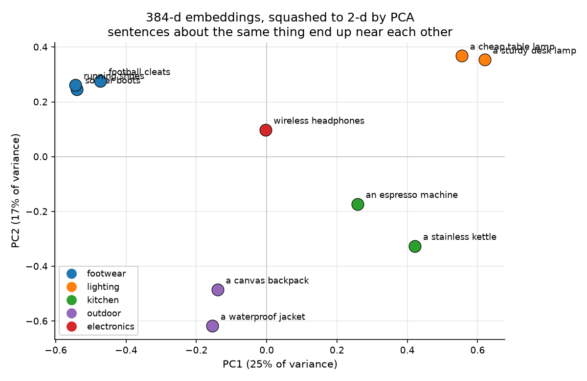
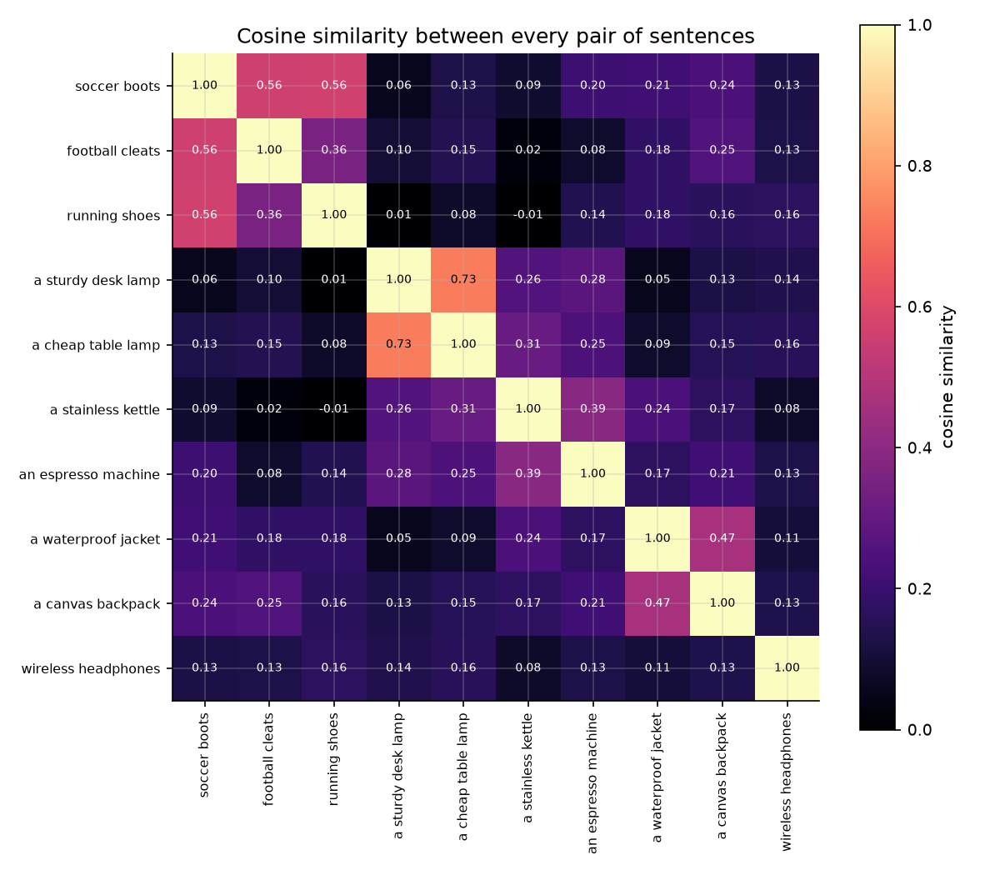
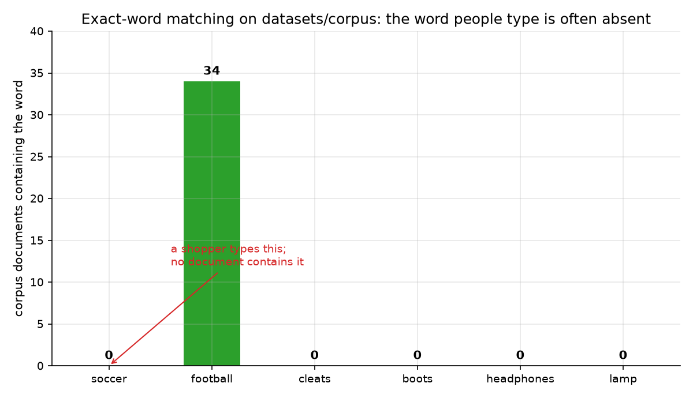
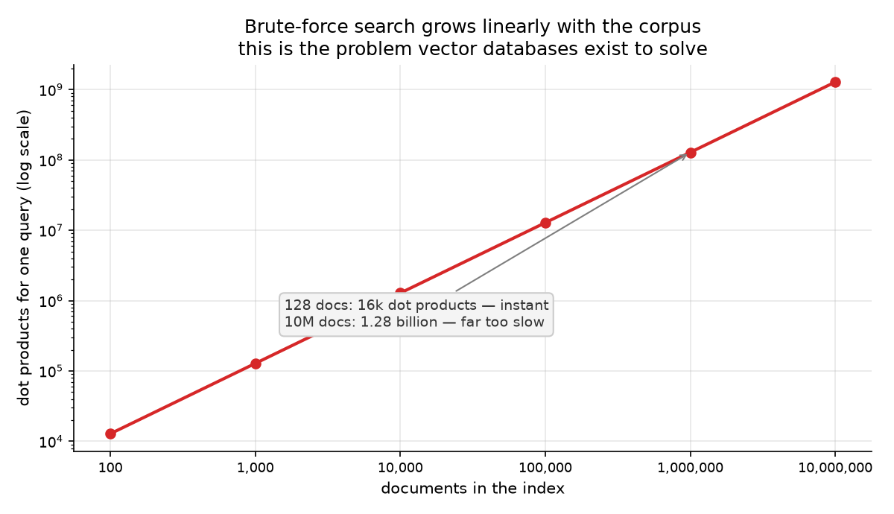

# Session 12 — Embeddings & Semantic Search
> Ten sessions of ranking by words. Today the words stop mattering and only meaning counts — and the engine finally answers the question Session 4 asked: why should `soccer` find football boots?

## What you'll learn
- What an embedding model actually returns, and what a vector *is*
- Why cosine similarity becomes a dot product once vectors are normalized
- The lexical gap, measured on our own corpus
- How meaning-based search finds documents that share no words with the query
- The brute-force scaling problem that creates the entire vector-database field

## Concepts

### 12.1 What an embedding model gives you

An **embedding** is a fixed-length list of numbers that stands in for a piece of
text. Feed the model a sentence and it returns 384 numbers for
`all-MiniLM-L6-v2`. Those numbers are not readable on their own — they only
mean something *relative to each other*.

That is the entire contract. Sentences about the same topic end up near each
other in that space; unrelated ones end up far apart. The scatter above is the
real 384-dimensional output squashed to two dimensions by PCA so a human can
see it. Note that the shoe sentences cluster on one side and the lamp
sentences on the other, even though no pair of them shares a single word.

Analogy: a map of a city. You cannot read street names off the coordinates, but
two addresses in the same district have nearly the same pair. Key terms:
**embedding**, **vector**, **dimension**, **semantic space**.

### 12.2 Cosine similarity, and why normalization makes it free

The diagonal of that heatmap is **1.0000** — every sentence's similarity with
itself. The interesting cells are off-diagonal: **soccer boots** against
**football cleats** is **0.5603**, while the same sentence against **wireless
headphones** is only **0.1269**. Neither pair shares a word.

Cosine similarity divides the dot product by both vector lengths. But if every
vector has already been scaled to length 1, both denominators are 1 and the
whole thing collapses to a single dot product. That is why `embed(...,
normalize_embeddings=True)` is not optional decoration: it turns a per-pair
calculation into one matrix multiply.

Analogy: comparing two arrows by the angle between them, not by how far they
reach. A short arrow and a long arrow pointing the same way point the same way.
Key terms: **cosine similarity**, **normalize**, **dot product**, **matrix
multiply**.

### 12.3 The gap this closes, measured on our own corpus

This chart is the Session 4 problem, counted rather than asserted. Across all
204 corpus documents, the word **soccer** appears **0** times. So does
**cleats**, so does **boots**. The word **football** appears in **34**
documents.

Every ranker you have built so far would return nothing for a query of `soccer`,
`cleats` or `boots`, because there is nothing to look up in an inverted index.
An embedding model does not need the word to be present: it matches the
*meaning*, and it will rank the 34 football documents first.

Analogy: asking for a specific book by title when the shelf is labelled by
subject. Key terms: **lexical gap**, **synonym**, **recall**, **semantic**.

### 12.4 Semantic search has real costs
Two things to be honest about before the next sessions. First, the result is
**probabilistic**: embeddings are good at broad meaning and weaker at exact
identifiers. Searching the solution for `durable backpack` returns tents
first, because in the shared product dataset the tent descriptions genuinely
contain more of that meaning than the backpack descriptions do.

Second, embedding a document costs a neural-network forward pass, which is
thousands of times more expensive than counting words. That is why you never
embed at query time: you embed once when you index, store the vectors, and
compare against them.

Analogy: a librarian who must read every book before shelving it, rather than
just scanning the spine. Key terms: **cost**, **offline**, **forward pass**,
**exact match**.

### 12.5 Brute force is the problem vector databases solve

Comparing one query against every document is `n` dot products. At 128 documents
that is 12,800 — instant. At ten million it is **1.28 billion** — far too slow
for a search box.

Nothing here is approximate yet, and nothing is wrong: this session is
deliberately the naive version, so you can see exactly what the next sessions
remove. **Approximate Nearest Neighbor** (ANN) indexes do not compare against
everything. They build a structure that groups similar vectors together
(HNSW makes a graph; IVF partitions into clusters) so a search only visits the
few regions likely to hold the answer, trading a little recall for a large speed
win.

Analogous to a phone book versus a face-recognizing crowd: exhaustive lookup
versus walking toward the people who look alike. Key terms: **brute force**,
**ANN**, **recall**, **trade-off**.

## Worked example
Embed two sentences that share no words and compare them (run from this
folder). New idea: `[0]` takes the first row of the 2D array `encode` returns.

```python
import sys
sys.path.insert(0, "workshop/solution")
from numpy_semantic_search import embed, load_model

model = load_model()
a = embed(model, ["football boots"])
b = embed(model, ["soccer cleats with studs"])
c = embed(model, ["a stainless steel kettle"])

print("same words?", set("football boots".split())
      & set("soccer cleats with studs".split()) or "none")
print("boots  vs cleats:", round(float(a[0] @ b[0]), 4))
print("boots  vs kettle :", round(float(a[0] @ c[0]), 4))
print("vector length    :", round(float((a[0] ** 2).sum() ** 0.5), 4))
```

Actual output (pasted from a real venv run):

```
same words? none
boots  vs cleats: 0.5603
boots  vs kettle : 0.1269
vector length    : 1.0000
```

Zero shared words, and the similarity is more than four times higher than an
unrelated sentence. The last line is the other half of the trick: the vector has
length exactly 1, which is why that single `@` produced a cosine similarity.

## Environment (venv)
Set up the course venv once (see **Environment setup** in the main `README.md`),
then activate it every study session; with it active, all commands are plain
`python ...`. This session needs the pre-cached
`sentence-transformers/all-MiniLM-L6-v2` model, which
`setup/download_models.py` downloads once. After that it runs **fully offline**.
No API key, no network, no paid service.

## How this connects to the workshop
The workshop embeds a ten-sentence catalogue by hand, checks that every vector
has length 1, and then asks three questions BM25 would score at zero: *soccer
boots*, *something to drink tea with*, and *a machine that makes coffee*. One
stop then turns the same code on the real 128-product dataset so you see both
where meaning search wins and where it is merely adequate.

## Common pitfalls
- Forgetting `normalize_embeddings=True` and then wondering why a long document wins every time.
- Comparing raw dot products against vectors that were never normalized, which measures length, not meaning.
- Embedding at query time. Embed documents once at index time; a query only needs one vector.
- Assuming embeddings handle exact identifiers. A product code or a person's name must be a keyword search — that is Session 22's job.
- Expecting BM25's behaviour. Embeddings rank; they do not filter, and every document gets a score.

## Self-check quiz
1. What does the 384 in "384-dimensional embedding" refer to, and why is the number itself meaningless?
2. Why is the cosine similarity of a sentence with itself exactly 1.0000?
3. Our corpus contains the word `soccer` zero times. What would BM25 return for that query, and what would embeddings return?
4. You forget `normalize_embeddings=True`. What breaks, and why does it look like a "long documents win" bug?
5. At ten million documents, how many dot products does one brute-force query need, and which field exists to avoid that?

<details>
<summary>Answers</summary>

1. It is the number of numbers in the vector. The value 384 has no meaning of its own; what matters is that the same model produces vectors in the same space.
2. Because a vector has cosine similarity 1 with itself by definition — the angle between a vector and itself is zero.
3. BM25 returns nothing: there is no posting list for `soccer`, so there is nothing to score. Embeddings return the 34 documents about football, because they match the meaning rather than the spelling.
4. Dot products then measure length as well as direction, so the longest document scores highest regardless of content. It looks like a relevance bug but it is a normalization bug.
5. 1.28 billion. Approximate Nearest Neighbor indexing (HNSW, IVF) exists to avoid comparing against everything.
</details>

## Next
[→ Start the workshop](workshop/WORKSHOP.md) — embed a catalogue, watch meaning beat spelling, then see the problem it creates.