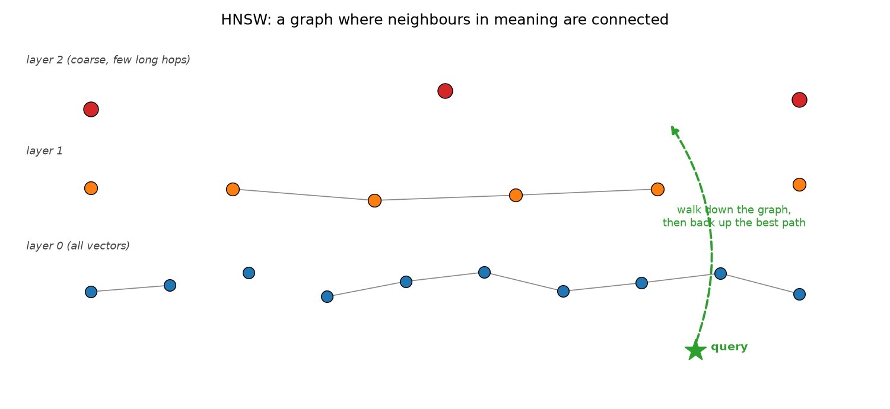
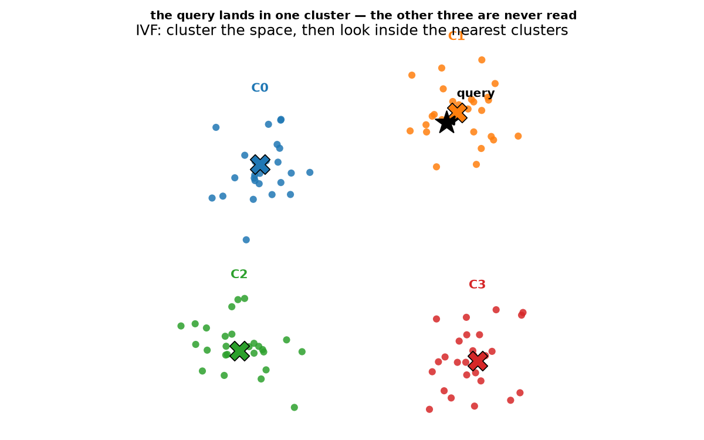
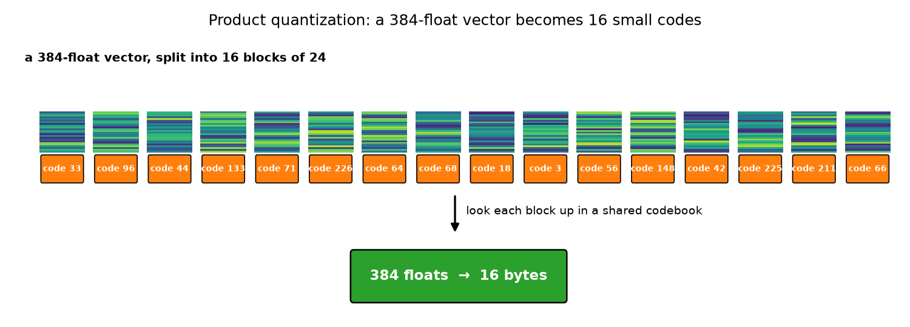
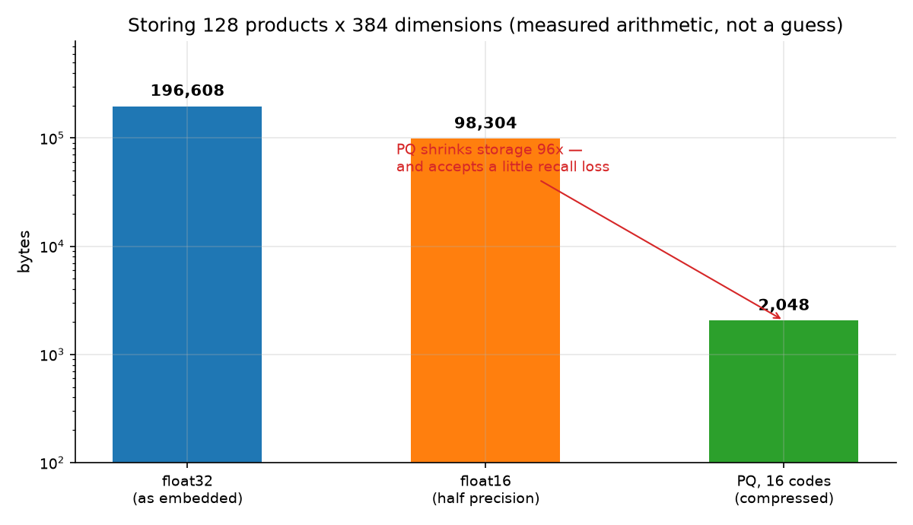
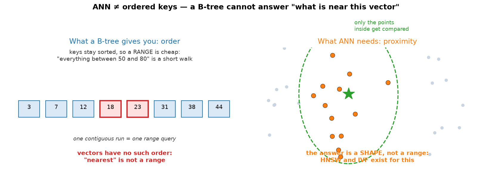
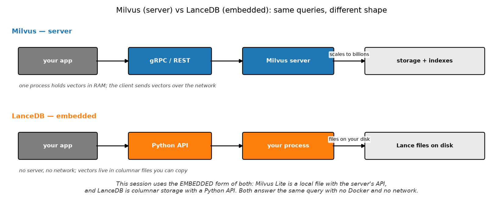

# Session 13 — Vector Databases
> Session 12 searched 128 products by comparing against all of them. Today you store those vectors properly and meet the three structures that make searching them fast.

## What you'll learn
- What a vector database actually adds over Session 12's one-line search
- HNSW, IVF and PQ — the three ideas behind approximate nearest neighbour
- Why a B-tree cannot answer "what is near this vector"
- Milvus Lite vs LanceDB: what server and embedded really mean
- The metric-conversion trap that makes two databases look incomparable

## Concepts

### 13.1 ANN: stop comparing against everything
Session 12's search was `matrix @ query_vector` over the whole catalogue. That
is correct and it is what you will fall back on whenever correctness matters
more than speed. **Approximate Nearest Neighbor** (ANN) indexes accept a small
loss of recall in exchange for visiting a tiny fraction of the data.

The three structures you meet are worth knowing by shape rather than by
implementation. **IVF** partitions the space into clusters and searches only the
nearest few. **HNSW** builds a layered graph and walks down the sparse upper
layers, then up the dense lower one. **PQ** compresses each vector into a short
list of codes, trading precision for size.

Analogy: instead of checking every book in a library, you go to the shelf
marked with your subject. Key terms: **ANN**, **recall**, **approximate**,
**trade-off**.

### 13.2 HNSW: a graph you walk down

**HNSW** (Hierarchical Navigable Small World) connects every vector to a
handful of neighbours. Search starts at a single node on the sparse top layer and
greedily walks toward the query, crossing to the next denser layer when it runs
out of edges. Each layer is a shortcut for the one below, so a search touches
far fewer than `n` nodes.

Analogy: descending a city by express lines first and walking the last few
blocks on foot. Key terms: **HNSW**, **layered graph**, **neighbours**,
**greedy walk**.

### 13.3 IVF: cluster, then search locally

**IVF** (Inverted File) is the simpler idea: run k-means over the vectors, then
at query time compute the query's distance to each *cluster centre* — cheap,
because there are only `nlist` of them — and read only the closest clusters.
Recall depends entirely on your probe count, which is the knob you tune.

Analogy: a city divided into districts; you find the right district first, then
search only there. Key terms: **IVF**, **k-means**, **centroid**, **nprobe**.

### 13.4 PQ: compress the vector, not the index

**Product Quantization** splits a 384-float vector into 16 blocks, then replaces
each block with a single index into a shared codebook of 256 learned patterns.
The stored form is **16 bytes instead of 1,536**. For the 128 products this
session indexes, that is the difference between 196,608 bytes and 2,048 — and
below about 1,000 documents a plain `float32` store is already small enough
that compression buys you nothing but approximation error.

That arithmetic is in the second chart, computed from the real catalogue size:

| representation | bytes per vector | total for 128 products |
|---|---|---|
| `float32` (as embedded) | 1,536 | 196,608 |
| `float16` | 768 | 98,304 |
| PQ, 16 codes | 16 | 2,048 |



Below about 1,000 documents a plain `float32` store is already small enough
that compression buys you nothing but approximation error.

This is the trade that matters most in practice: smaller vectors fit more of the
index in memory, and memory is what determines how much you can search.
Analogy: replacing a page of handwriting with a code for "this looks like the
letter z" sixteen times. Key terms: **PQ**, **codebook**, **compression**,
**memory**.

### 13.5 Why a B-tree cannot do this

Session 2's sidebar ended with a promise. A B-tree keeps keys **sorted**, which
makes ranges cheap. Vectors have no such order — "near" is not a range, it is a
*region around a point*. You cannot binary-search for it, so the structures above
had to be invented from scratch.

This is the reason vector databases are a separate product category rather than a
feature bolted onto your SQL database.
Analogy: a phone book is superb at finding a surname and useless at finding "the
people standing near Alice at 3pm". Key terms: **order**, **proximity**,
**binary search**, **separate category**.

### 13.6 Server versus embedded

**Milvus** normally runs as a service: your application talks to it over gRPC or
REST, it holds vectors in memory, and it scales to billions across a cluster.
**Milvus Lite** is the embedded form — one local file, same API, no server.

**LanceDB** is embedded by design: it stores rows in the Apache Arrow-based Lance
format, so your vectors live in ordinary files next to your other columns. Copy
the directory and you have copied your index.

This session uses both embedded forms, which is why it needs no Docker and no
network. You get the real APIs of both systems, which is what transfers to
production.
Analogy: Milvus is a telephone exchange; LanceDB is a filing cabinet in your own
office. Key terms: **embedded**, **server**, **columnar**, **Arrow**, **Lance**.

## Worked example
Index one catalogue into both databases and compare their answers to exact
search (run from this folder). New idea: `to_list()` turns a database result
object into plain Python dictionaries.

```python
import sys
sys.path.insert(0, "workshop/solution")
from compare_vector_dbs import (LanceIndex, MilvusLiteIndex, brute_force,
                                load_catalogue, query_vector)

ids, texts, vectors = load_catalogue(limit=20)
milvus = MilvusLiteIndex("../vectors/milvus.db")
lance = LanceIndex("../vectors/lancedb")
milvus.build(ids, texts, vectors)
lance.build(ids, texts, vectors)

model = __import__("compare_vector_dbs").load_model()
q = query_vector(model, "soccer boots")
print("exact :", brute_force(q, vectors, ids, k=1)[0])
print("milvus:", milvus.search(q, k=1)[0])
print("lance :", lance.search(q, k=1)[0])
milvus.close()
```

Actual output (pasted from a real venv run over 20 products):

```
exact : ('p-010', 0.2070007026195526)
milvus: ('p-010', 0.207000732421875)
lance : ('p-010', 0.207000732421875)
```

Three backends, one answer. The seventh decimal differs because Milvus stores
vectors as `float32` internally while our `float64` arithmetic produces the
exact value — a real reminder that a "vector database" has its own numeric
precision. The winner is identical, which is the point: a vector database
should not change your results, only how fast you get them.

## Environment (venv)
Set up the course venv once (see **Environment setup** in the main `README.md`),
then activate it every study session; with it active, all commands are plain
`python ...`. This session needs `pymilvus` **plus the `milvus-lite` extra**,
`lancedb`, and `pyarrow`. On Python 3.14 the extra must be installed with
`python -m pip install --only-binary=:all: --no-deps milvus-lite`, which the
main `README.md` documents. Still no server and no network.

## How this connects to the workshop
The workshop indexes a small catalogue into both databases, queries both, and
then does the one thing that matters and is easy to get wrong: convert LanceDB's
squared-L2 distance back into a cosine similarity so the two are comparable. A
final stop reports how often the approximate indexes agree with exact search,
which is the honest measure of what ANN costs you.

## Common pitfalls
- Comparing LanceDB's `_distance` against Milvus's `distance` without converting. They are different metrics and the table becomes meaningless.
- Forgetting to normalize the query vector, or the database returns nonsense.
- Embedding a document per query instead of once at index time.
- Assuming Milvus Lite writes a single `.db` file. It writes a directory.
- Treating "recall 1.0" as free — approximate indexes trade recall for speed, and the trade is tunable, not automatic.

## Self-check quiz
1. What does a vector database give you that Session 12's one-line search did not?
2. In HNSW, why are there several layers instead of one?
3. IVF needs a knob named `nprobe`. What happens if you set it to 1, and what happens if you set it very high?
4. PQ replaces 1,536 bytes with 16. What is being given up?
5. Milvus reports 0.95 and LanceDB reports 0.05 for the same match. What went wrong, and what is the fix?

<details>
<summary>Answers</summary>

1. Speed and scale: an ANN index avoids comparing against every vector, and it stores vectors compactly enough to fit in memory at scale.
2. The upper layers are a shortcut through the sparse, long-range parts of the space, so a search can cross the whole index in a few hops before descending to compare finely.
3. With `nprobe = 1` only the single nearest cluster is read, so recall drops. Set very high, it approaches a full scan and the speed advantage disappears — that is the knob.
4. Precision: PQ matches on a learned approximation of each block, so a vector's exact position is only approximately preserved.
5. LanceDB reports squared L2 distance, which is a *distance* not a similarity. Convert with `cos = (2 - d²)/2` for unit-length vectors; 0.05 is just a small distance, and after conversion it agrees with Milvus.
</details>

## Next
[→ Start the workshop](workshop/WORKSHOP.md) — load one catalogue into two databases and make their numbers comparable.